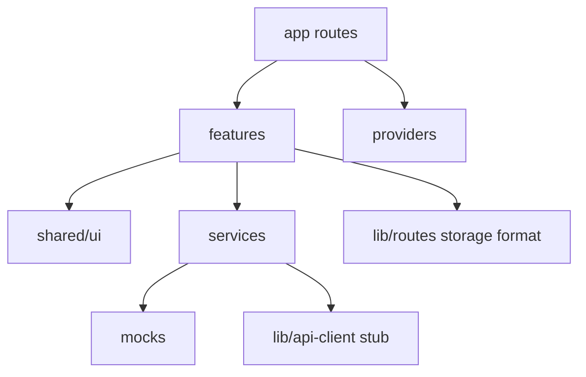
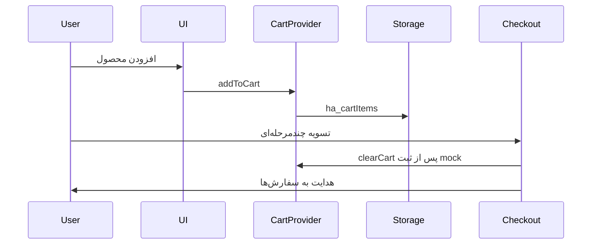

# هایپر آهن — مستند معماری، ریپازیتوری و سناریوها

> مخاطب: توسعه‌دهنده، محصول، یا ایجنت AI که باید سریع بفهمد پروژه چیست، کجاست، چطور ساخته شده، و الان چه کارهایی با اپ ممکن است.  
> وضعیت: **فرانت‌اند MVP مشتری** روی Next.js — دادهٔ mock؛ اتصال API فاز بعد.

---

## ۱. معرفی محصول

**هایپر آهن** یک بازار آنلاین موبایل‌فرست برای خرید آهن‌آلات است (میلگرد، تیرآهن، ورق، پروفیل، نبشی و …).

هدف فاز فعلی:

- نمایش قیمت و محصول به‌صورت ساده روی گوشی
- افزودن به سبد و ثبت درخواست خرید کارشناسی
- پیگیری وضعیت سفارش در پنل مشتری

پرداخت آنلاین، پنل ادمین کامل، و موجودی واقعی در این فاز نیستند (طبق `mvp-ahanalat.md`).

---

## ۲. ریپازیتوری

| مورد | مقدار |
|------|--------|
| نام | `hyper-ahan` |
| آدرس | https://github.com/ArashAslani/hyper-ahan |
| شاخه اصلی | `master` |
| مسیر محلی | `Front/hyper-ahan/` |
| لایسنس | فایل `LICENSE` در ریشه |

### کلون و اجرا

```bash
git clone https://github.com/ArashAslani/hyper-ahan.git
cd hyper-ahan
npm install
npm run dev
```

| دستور | کاربرد |
|--------|--------|
| `npm run dev` | توسعه — http://localhost:3000 |
| `npm run build` | ساخت production |
| `npm run start` | اجرای build |
| `npm run lint` | ESLint |

### تاریخچه کوتاه

1. Scaffold اولیه Create Next App  
2. مهاجرت UI از Vite/React + معماری لایه‌ای  
3. بازطراحی Mobile-First Design System + مسیر مشتری MVP  

### مستندات مرتبط در همین ریپو

| فایل | محتوا |
|------|--------|
| [`README.md`](../README.md) | شروع سریع |
| [`docs/CONVENTIONS.md`](CONVENTIONS.md) | قوانین توسعه (اجباری) |
| [`docs/mvp-ahanalat.md`](mvp-ahanalat.md) | محدوده محصول MVP |
| [`docs/frontend-integration.md`](frontend-integration.md) | قرارداد API بک‌اند |
| [`docs/ARCHITECTURE.md`](ARCHITECTURE.md) | همین فایل |

---

## ۳. استک فنی

| لایه | تکنولوژی |
|------|-----------|
| فریمورک | Next.js 16 (App Router) |
| زبان | TypeScript |
| UI | React 19 |
| استایل | Tailwind CSS 4 + CSS Variables |
| فونت | Vazirmatn (`next/font`) |
| آیکون | FontAwesome |
| اسلایدر | Swiper |
| state سبد | Context + `localStorage` |
| داده فعلی | Mock پشت `services/*` |

Proxy آماده برای API در `next.config.ts`: درخواست‌های `/api/*` → `http://localhost:5062`.

---

## ۴. معماری

### اصل طلایی

صفحه و کامپوننت UI **هرگز** مستقیم `fetch` یا mock را نمی‌شناسند.  
فقط از `services` و تایپ‌های دامنه استفاده می‌کنند. تعویض mock → API فقط در لایهٔ service است.

### لایه‌ها

```text
src/app/            مسیرها، layout، metadata
src/features/       UI و منطق دامنه هر قابلیت
src/shared/ui/      Design System (بدون منطق کسب‌وکار)
src/services/       قرارداد داده (الان mock)
src/mocks/          داده نمونه
src/providers/      CartProvider، Toast، …
src/lib/            routes، storage، format، api-client
src/config/         site، nav
src/types/          تایپ‌های دامنه
```



### ناوبری Shell

- **TopBar (۵۶px):** لوگو، تماس، جستجو، سبد  
- **Bottom Nav:** خانه / دسته‌ها / سبد / سفارش‌ها / پروفایل  
- عرض محتوا محدود به `max-w-xl` (حس اپ موبایل روی دسکتاپ)

منبع لینک‌ها: `src/lib/routes.ts` و `src/config/nav.config.ts`.

### Design Tokens (خلاصه)

| نقش | مقدار |
|-----|--------|
| Primary | `#1A1A2E` |
| Accent | `#E67E22` |
| Background | `#F5F5F0` |
| Text | `#222222` / muted `#555555` |
| Success / Danger | `#27AE60` / `#E74C3C` |

تعریف کامل در `src/app/globals.css`.

---

## ۵. مسیرهای اپ (Routes)

| مسیر | صفحه | توضیح |
|------|------|--------|
| `/` | Home | هیرو، دسته‌ها، قیمت روز، CTA |
| `/categories` | Categories | گرید دسته‌بندی |
| `/products` | Products | لیست + جستجو + فیلتر BottomSheet |
| `/products/[id]` | Product detail | قیمت بزرگ، افزودن به سبد، تماس |
| `/product-category/[slug]` | Category filter | فیلتر mock بر اساس slug |
| `/search` | Search | ورودی جستجو → هدایت به محصولات |
| `/cart` | Cart | اقلام، تعداد، خلاصه چسبان |
| `/checkout` | Checkout | ۳ مرحله اطلاعات / آدرس / توافق‌نامه |
| `/login` | Login | UI ورود با OTP (منطق mock) |
| `/register` | Register | ثبت‌نام ساده mock |
| `/profile` | Profile | اطلاعات کاربر + آخرین سفارش‌ها |
| `/orders` | Orders | لیست سفارش‌ها + تایم‌لاین |
| `/orders/[id]` | Order detail | جزئیات و وضعیت |
| `/about` `/contact` | Content | درباره / تماس |
| `/articles` … | Articles | باقی‌مانده از نسخه قبل (اولویت پایین MVP) |

---

## ۶. وضعیت سفارش (MVP)

هم‌تراز با بک‌اند:

```text
Submitted → InReview → Confirmed → Completed
                ↘ Cancelled (از اکثر مراحل)
```

برچسب UI در تایم‌لاین چهارمرحله‌ای نمایش داده می‌شود.

---

## ۷. سناریوهای کاربری (چه کارهایی با اپ می‌شود کرد)

### سناریو A — مشاهده قیمت و خرید سریع (کارگر / پیمانکار خرد)

1. ورود به خانه بدون ثبت‌نام  
2. دیدن قیمت روز یا رفتن به «محصولات»  
3. فیلتر کارخانه / جستجوی سایز  
4. باز کردن جزئیات → **افزودن به سبد**  
5. سبد → تسویه  
6. تکمیل نام، موبایل، کد ملی، آدرس  
7. تیک توافق‌نامه → ثبت سفارش  
8. پیام: کارشناس تماس می‌گیرد  
9. پیگیری در «سفارش‌ها»

### سناریو B — تماس فوری بدون خرید

1. از TopBar دکمه تماس  
2. یا از جزئیات محصول / خانه CTA تماس  
3. شماره‌گیری مستقیم (`tel:`)

### سناریو C — مرور دسته‌ای

1. Bottom Nav → دسته‌ها  
2. انتخاب میلگرد / تیرآهن / …  
3. لیست فیلترشده → جزئیات → سبد

### سناریو D — ورود و حساب

1. پروفایل یا لاگین  
2. وارد کردن موبایل → کد mock  
3. مشاهده پروفایل و سفارش‌های نمونه  
4. باز کردن جزئیات سفارش و تایم‌لاین وضعیت

### سناریو E — جستجو

1. آیکون جستجو در TopBar  
2. وارد کردن عبارت  
3. هدایت به لیست محصولات (فیلتر سمت کلاینت)

### آنچه الان «کار می‌کند» ولی mock است

| قابلیت | واقعیت فعلی |
|--------|-------------|
| کاتالوگ و قیمت | داده ثابت در `mocks/` |
| سبد | `localStorage` کلیدهای `ha_*`؛ قفل قیمت محلی |
| OTP | UI آماده؛ کد واقعی SMS نیست |
| ثبت سفارش | toast موفقیت؛ بدون API سفارش |
| وضعیت سفارش | لیست mock در profileService |
| فیلتر/جستجو | فقط کلاینت روی mock |

### آنچه عمداً نیست (فاز بعد)

- پرداخت آنلاین / بیعانه  
- پنل ادمین  
- Favorites / Notifications  
- ماشین‌حساب وزن واقعی  
- موجودی زنده و SignalR قیمت  
- JWT واقعی و محافظت مسیرها  

---

## ۸. جریان داده سبد و خرید



کلیدهای storage مهم (`src/lib/storage.ts`):

- `ha_cartItems`  
- `ha_sessionToken` / `ha_cartId` (آماده فاز API)  
- `ha_accessToken` / `ha_user` / `ha_isProfileComplete`  

---

## ۹. Design System — کامپوننت‌های مشترک

مسیر: `src/shared/ui/`

| کامپوننت | کاربرد |
|----------|--------|
| `Button` | primary / accent / outline / ghost / danger |
| `Input` / `Textarea` | floating label، لمسی |
| `SearchBar` | جستجو |
| `ProductCard` | کارت محصول با قیمت برجسته |
| `PriceBadge` | نمایش قیمت |
| `BottomSheet` | فیلتر |
| `Modal` / `Toast` | دیالوگ و بازخورد |
| `Skeleton` / `EmptyState` | حالت‌های خالی/لود |
| `OrderTimeline` / `Stepper` | پیگیری و چک‌اوت |
| `CartSummaryBar` | نوار چسبان سبد |
| `Fab` | دکمه شناور فیلتر |

---

## ۱۰. قوانین توسعه (خلاصه)

جزئیات: [`CONVENTIONS.md`](CONVENTIONS.md)

1. مسیر فقط از `routes.ts`  
2. داده فقط از `services/*`  
3. storage فقط از `storage.ts`  
4. رنگ فقط از توکن‌ها (نه `blue-*` خام)  
5. `'use client'` فقط وقتی لازم است  
6. Bottom Nav از `nav.config.ts`  

---

## ۱۱. نقشه راه کوتاه

| فاز | محتوا | وضعیت |
|-----|--------|--------|
| مهاجرت Next + معماری | لایه‌ها، routes، services | انجام شده |
| Mobile-First UX | Design System، Shell، صفحات مشتری | انجام شده |
| اتصال API | `api-client` + تعویض services طبق `frontend-integration.md` | بعدی |
| Auth OTP واقعی | JWT، پروفایل، آدرس | بعدی |
| سفارش واقعی | POST order + پنل سفارش‌های زنده | بعدی |
| ادمین حداقلی | در صورت نیاز طبق integration | بعدتر |

---

## ۱۲. معیار موفقیت محصول (یادآوری MVP)

اپ وقتی موفق است که کاربر موبایل بتواند از لندینگ تا ثبت درخواست خرید (`Submitted`) برسد و بعد از کار کارشناس، وضعیت را تا `Completed` ببیند — نه اینکه همه فیچرها کامل باشند.

الان مسیر UI این فلو را شبیه‌سازی می‌کند؛ اتصال بک‌اند گام بعدی است.
