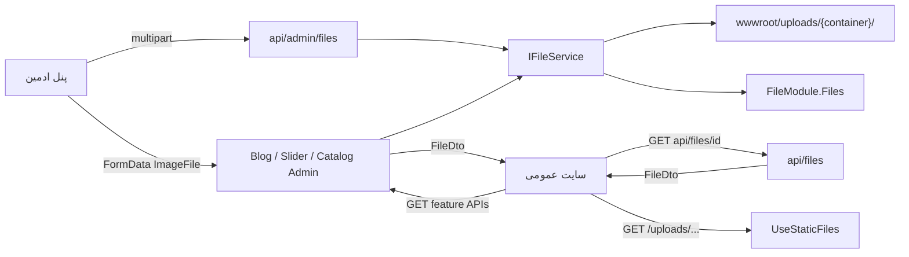

# انتگریت فرانت با FileModule

> مخاطب: تیم React برای مصرف تصاویر/رسانه در سایت عمومی و پنل ادمین.  
> Base URL توسعه: `http://localhost:5062` · HTTPS: `https://localhost:7202` · Swagger: `/swagger`  
> قرارداد کلی API: [`frontend-integration.md`](frontend-integration.md) (§۲ اتصال، §۳ `OperationResult`)  
> همهٔ فیلدها **camelCase** هستند.

**نقش این ماژول = منبع واحد ذخیره و آدرس‌دهی فایل تصویر.**

دو مسیر مصرف:

1. **غیرمستقیم (رایج):** آپلود داخل Create/Update بلاگ/اسلایدر/کاتالوگ → پاسخ با `FileDto`
2. **مستقیم:** API خود FileModule برای مدیا لایبرری / پیش‌نمایش / آپلود مستقل

| سطح | پایه | کنترلر |
|---|---|---|
| عمومی | `api/files` | `FilesController` |
| ادمین | `api/admin/files` | `AdminFilesController` |

ماژول‌های مصرف‌کننده (embedded `FileDto`):

| ماژول | سند | فیلد پاسخ | container |
|---|---|---|---|
| Slider | [`SliderModule_frontend_integration.md`](SliderModule_frontend_integration.md) | `image` / `mobileImage` | `slider` |
| Blog | [`BlogModule_frontend_integration.md`](BlogModule_frontend_integration.md) | `image` | `blog` |
| Catalog | [`frontend-catalog-integration.md`](frontend-catalog-integration.md) | `image` | `catalog` |

---

## ۱. مدل ذهنی



| مفهوم | معنی |
|---|---|
| **FileDto** | قرارداد عمومی رسانه — برای `` همین را مصرف کنید |
| **StoredFileResultDto** | پاسخ آپلود/جزئیات ادمین (نام اصلی، حجم، contentType) |
| **container** | پوشهٔ منطقی: `blog` / `slider` / `catalog` (یا نام معتبر دیگر) |
| **PublicBaseUrl** | مبدأ absolute برای `url` / `thumbnailUrl` |
| **Reference count** | با Delete ادمین کم می‌شود؛ در صفر از دیسک پاک می‌شود |

---

## ۲. قرارداد `FileDto` (مصرف عمومی و ادمین)

منبع: `FileModule/Application/DTOs/FileDtos.cs`

```ts
/** قرارداد یکسان تصویر در همهٔ APIهای HyperAhan */
type FileDto = {
  id: string;                    // Guid فایل در FileModule
  url: string;                   // absolute — آماده برای 
  thumbnailUrl?: string | null;  // absolute یا null
  width?: number | null;         // پیکسل
  height?: number | null;
  alt?: string | null;           // متن جایگزین (ممکن است از title موجودیت پر شود)
};
```

نمونه داخل پاسخ یک محصول/اسلاید/مقاله:

```json
{
  "image": {
    "id": "a1b2c3d4-e5f6-7890-abcd-ef1234567890",
    "url": "https://localhost:7202/uploads/blog/9f3c2a1b.webp",
    "thumbnailUrl": "https://localhost:7202/uploads/blog/thumbs/9f3c2a1b.webp",
    "width": 1600,
    "height": 900,
    "alt": "عنوان مقاله"
  }
}
```

### قوانین مصرف در فرانت

| قانون | جزئیات |
|---|---|
| همیشه `image.url` | دیگر `imageUrl` / `imageName` / مسیر نسبی دستی نسازید |
| URL absolute است | معمولاً نیازی به `VITE_API_ORIGIN + path` نیست |
| اگر `image === null` | placeholder یا مخفی کردن تصویر |
| لیست/کارت | ترجیح `thumbnailUrl ?? url` برای عملکرد |
| جزئیات/هیرو | `url` کامل + `width`/`height` برای جلوگیری از CLS |
| `alt` | `image.alt ?? fallbackTitle` |
| `id` | برای دیباگ/کش؛ معمولاً در UI لازم نیست |

```tsx
function MediaImage({
  image,
  fallbackAlt,
  preferThumb = false,
}: {
  image?: FileDto | null;
  fallbackAlt: string;
  preferThumb?: boolean;
}) {
  if (!image?.url) return null;
  const src = preferThumb ? (image.thumbnailUrl ?? image.url) : image.url;
  return (
    
  );
}
```

---

## ۳. مسیر فیزیکی و سرو استاتیک

| مورد | مقدار فعلی Dev |
|---|---|
| ریشهٔ دیسک | `wwwroot/uploads` |
| الگوی URL نسبی | `uploads/{container}/{guid}.{ext}` |
| thumbnail | `uploads/{container}/thumbs/{guid}.{ext}` (اگر عرض > `ThumbnailMaxWidth`) |
| سرو فایل | `app.UseStaticFiles()` → درخواست مستقیم به `/uploads/...` |
| مبدأ absolute در JSON | `FileStorage:PublicBaseUrl` = `https://localhost:7202` |

### پروکسی Vite (پیشنهادی)

چون `url` absolute به پورت HTTPS می‌خورد، دو حالت رایج:

**الف) استفاده مستقیم از absolute URLهای API** (ساده‌ترین — CORS استاتیک معمولاً برای `` مشکل نیست)

```ts

```

**ب) پروکسی نسبی** اگر می‌خواهید همه چیز از origin فرانت بیاید:

```ts
// vite.config.ts
server: {
  proxy: {
    '/api': { target: 'http://localhost:5062', changeOrigin: true },
    '/uploads': { target: 'https://localhost:7202', changeOrigin: true, secure: false },
  },
}
```

و در صورت نیاز URL را نسبی کنید:

```ts
function toProxyUploads(absoluteUrl: string) {
  try {
    const u = new URL(absoluteUrl);
    if (u.pathname.startsWith('/uploads/')) return u.pathname + u.search;
  } catch { /* ignore */ }
  return absoluteUrl;
}
```

> مسیر قدیمی `docs/blog/...` و `docs/slider/...` منسوخ است.

---

## ۴. API مستقیم FileModule

### ۴.۱ عمومی — `api/files`

| Method | Path | Auth | پاسخ `result` |
|---|---|---|---|
| `GET` | `/api/files/{id}` | عمومی | `FileDto` |

```ts
const res = await api.get(`/api/files/${fileId}`);
// res.result.url → 
```

### ۴.۲ ادمین — `api/admin/files` (Bearer `Admin`)

| Method | Path | Body | پاسخ `result` |
|---|---|---|---|
| `GET` | `/api/admin/files/{id}` | — | `StoredFileResultDto` |
| `POST` | `/api/admin/files/images` | multipart | `StoredFileResultDto` (Created/Success) |
| `PUT` | `/api/admin/files/images/{id}` | multipart | `StoredFileResultDto` |
| `DELETE` | `/api/admin/files/{id}` | — | موفقیت — reference آزاد می‌شود |

#### آپلود مستقیم

```ts
const fd = new FormData();
fd.append('File', file);           // نام فیلد: File
fd.append('Container', 'slider');  // blog | slider | catalog | ...
fd.append('Alt', 'توضیح تصویر');   // اختیاری

const res = await api.post('/api/admin/files/images', fd);
// res.result: StoredFileResultDto — id را برای اتصال به موجودیت نگه دارید
```

#### جایگزینی

```ts
const fd = new FormData();
fd.append('File', newFile);
fd.append('Container', 'blog');
await api.put(`/api/admin/files/images/${existingId}`, fd);
```

`DELETE` فقط reference را کم می‌کند؛ اگر فایل هنوز به موجودیت دیگری وصل باشد از دیسک پاک نمی‌شود.

---

## ۵. آپلود غیرمستقیم (داخل فیچرها)

همچنان رایج‌ترین الگو — Create/Update خود موجودیت:

| فیچر | مسیر ادمین | فیلد FormData |
|---|---|---|
| بلاگ | `POST/PUT /api/admin/blog/posts` | `ImageFile` |
| اسلایدر | `POST/PUT /api/admin/sliders` | `ImageFile` (+ `MobileImageFile`) |
| کاتالوگ | Create/Update ادمین محصول | `ImageFile` |

```ts
const fd = new FormData();
// ... فیلدهای متنی موجودیت
fd.append('ImageFile', file);
await api.post('/api/admin/...', fd);
// پاسخ موجودیت شامل image: FileDto
```

### قوانین اعتبارسنجی سمت سرور

| قانون | مقدار فعلی |
|---|---|
| فرمت مجاز | `jpg`, `jpeg`, `png`, `gif`, `webp`, `bmp` |
| حداکثر حجم | ۵ مگابایت (`MaxImageBytes`) |
| فایل خالی / خراب | BadRequest |
| `container` نامعتبر | فقط حروف/عدد/`-`/`_` |

```ts
const ACCEPT = 'image/jpeg,image/png,image/gif,image/webp,image/bmp';
const MAX_BYTES = 5 * 1024 * 1024;
```

در Update فیچر معمولاً `ImageFile` را نفرستید → تصویر قبلی می‌ماند.  
حذف مقاله/اسلاید/محصول خودش `Release` می‌کند.

---

## ۶. `StoredFileResultDto` (پاسخ ادمین / آپلود مستقیم)

```ts
type StoredFileResultDto = {
  id: string;
  originalFileName: string;
  contentType: string;
  size: number;
  width?: number | null;
  height?: number | null;
  url: string;
  thumbnailUrl?: string | null;
  alt?: string | null;
};
```

برای رندر UI عمومی همان `FileDto` کافی است (`id/url/thumbnailUrl/width/height/alt`).

---

## ۷. پیکربندی سرور مرتبط با فرانت

بخش `FileStorage` در `appsettings.json`:

| کلید | پیش‌فرض Dev | اثر روی فرانت |
|---|---|---|
| `PublicBaseUrl` | `https://localhost:7202` | مبدأ `url` / `thumbnailUrl` |
| `RootPath` | `wwwroot/uploads` | مسیر فیزیکی |
| `MaxImageBytes` | `5242880` (۵MB) | سقف آپلود |
| `GenerateThumbnail` | `true` | ممکن است `thumbnailUrl` پر شود |
| `ThumbnailMaxWidth` | `400` | اگر عرض ≤۴۰۰، thumbnail ساخته نمی‌شود → `thumbnailUrl=null` |
| `GenerateWebP` | `false` | اگر true شود پسوند/نوع خروجی webp می‌شود |
| `DeduplicateByChecksum` | `false` | اگر true، فایل تکراری reference می‌گیرد |

در Production مقدار `PublicBaseUrl` باید دامنهٔ عمومی API/CDN باشد؛ فرانت نباید hardcode به localhost بزند — همان `url` برگشتی را استفاده کنید.

---

## ۸. نگاشت فیلدها در پاسخ ماژول‌ها

### Slider

```ts
type PublicSlide = {
  image: FileDto | null;
  mobileImage: FileDto | null;
  images: FileDto[]; // [image, mobileImage] بدون null
  // ...
};
```

رندر ریسپانسیو:

```tsx
<picture>
  {slide.mobileImage?.url && (
    <source media="(max-width: 768px)" srcSet={slide.mobileImage.url} />
  )}
  
</picture>
```

### Blog

```ts
type BlogPost = {
  image: FileDto | null;
  // دیگر imageUrl / imageName نیست
};
```

برای OG/JSON-LD از `image.url` (absolute) استفاده کنید.

### Catalog

```ts
type ProductListItem = {
  image: FileDto | null;
};
```

در گرید محصول: `thumbnailUrl ?? url`.

---

## ۹. خطاهای رایج مربوط به فایل

| پیام / وضعیت | علت | رفتار فرانت |
|---|---|---|
| فایل الزامی است | Create/آپلود بدون فایل | اعتبارسنجی قبل از submit |
| حداکثر حجم تصویر N مگابایت است | فایل > سقف | پیام فرم |
| فرمت تصویر مجاز نیست | پسوند خارج از لیست | راهنمای accept |
| فایل تصویر خراب یا نامعتبر است | فایل غیرتصویر | پیام خطا |
| فایل یافت نشد | id غلط / حذف‌شده | placeholder یا ۴۰۴ |
| نام container نامعتبر است | کاراکتر غیرمجاز در container | فقط `a-z0-9-_` |
| شکسته بودن `` | `PublicBaseUrl` / پروکسی | Network روی URL فایل |

---

## ۱۰. محدودیت‌ها و نکات فعلی

| مورد | وضعیت |
|---|---|
| API مستقیم | `api/files` + `api/admin/files` |
| لیست/جستجوی مدیا لایبرری | هنوز نیست |
| انواع غیرتصویر (PDF و …) | پشتیبانی نمی‌شود |
| CDN / S3 | فعلاً LocalDisk؛ `FileDto` ثابت می‌ماند |
| Auth روی فایل استاتیک | `/uploads/...` عمومی است |
| Delete ادمین | reference-count — حذف فیزیکی فقط وقتی صفر شود |

---

## ۱۱. چک‌لیست فرانت

- [ ] تایپ مشترک `FileDto` / `StoredFileResultDto`
- [ ] کامپوننت `MediaImage` با fallback و thumb
- [ ] در صورت نیاز مدیا لایبرری: `POST /api/admin/files/images` + `GET /api/files/{id}`
- [ ] حذف `imageUrl` / `imageName` / `docs/...`
- [ ] فرم‌های فیچر: FormData + سقف ۵MB
- [ ] لیست‌ها با `thumbnailUrl ?? url`
- [ ] پروکسی `/uploads` یا absolute URLهای API

---

## ۱۲. مرجع کد بک‌اند

| لایه | مسیر |
|---|---|
| Controllers | `WebApi/Controllers/File/FilesController.cs`, `AdminFilesController.cs` |
| DTOs | `FileModule/Application/DTOs/FileDtos.cs` |
| Service | `FileModule/Application/Services/FileService.cs` · `IFileService` |
| Options | `FileStorage` در `appsettings.json` |
| Storage | `LocalDiskStorageProvider` → `wwwroot/uploads` |
| Host | `Program.cs` → `InitFileModule` + `UseStaticFiles` |

---

## ۱۳. ارتباط با اسناد دیگر

| سند | نقش |
|---|---|
| [`frontend-integration.md`](frontend-integration.md) | اتصال کلی، `OperationResult`، پروکسی |
| [`SliderModule_frontend_integration.md`](SliderModule_frontend_integration.md) | آپلود دسکتاپ/موبایل اسلایدر |
| [`BlogModule_frontend_integration.md`](BlogModule_frontend_integration.md) | تصویر مقاله و SEO |
| [`frontend-catalog-integration.md`](frontend-catalog-integration.md) | تصویر محصول |
