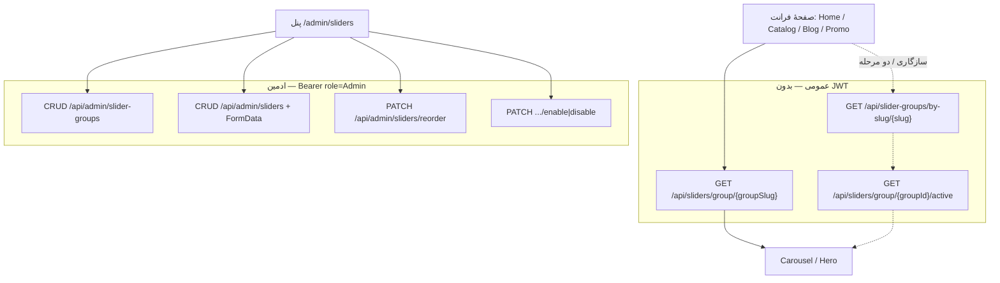

# انتگریت فرانت با SliderModule

> مخاطب: تیم React برای بنر/کاروسل لندینگ، صفحهٔ فروشگاه، بلاگ و پنل ادمین اسلایدر.  
> Base URL توسعه: `http://localhost:5062` · HTTPS: `https://localhost:7202` · Swagger: `/swagger`  
> قرارداد کلی API: [`frontend-integration.md`](frontend-integration.md) (§۲ اتصال، §۳ `OperationResult`)  
> همهٔ فیلدها **camelCase** هستند.

**نقش این ماژول = بنر و کاروسل قابل‌مدیریت (content placement).** خرید/سبد/OTP اینجا نیست. کاتالوگ، Auth و بلاگ سند جدا دارند.

Seed ندارد؛ خالی بودن داده در Dev مجاز است — UI را graceful خالی/fallback کنید، ولی مسیرها و کامپوننت را از روز اول بسازید.

**جداسازی مسیر API (مثل Blog/Catalog):**

| سطح | پایه | کنترلر |
|---|---|---|
| عمومی | `api/sliders` · `api/slider-groups` | `SlidersController` · `SliderGroupsController` |
| ادمین | `api/admin/sliders` · `api/admin/slider-groups` | `AdminSlidersController` · `AdminSliderGroupsController` |

---

## ۱. مدل ذهنی



| مفهوم | معنی |
|---|---|
| **SliderGroup** | جایگاه نمایش (هیرو هوم، بنر بلاگ، …) — با **slug** ثابت در فرانت |
| **Slider** | یک اسلاید: تصویر (+ موبایل اختیاری) + عنوان + لینک + CTA + زمان‌بندی + ترتیب |
| **DisplayOrder** | ترتیب اصلی (۰، ۱، ۲، …) — با `reorder` ادمین |
| **Priority** | اولویت ثانویه (نزولی) وقتی `displayOrder` برابر است |
| **FileDto** | قرارداد یکسان رسانه از `FileModule` — URLها **absolute** هستند |
| **Link** | مقصد کلیک — مسیر فرانت یا URL مطلق |

### قوانین نمایش عمومی (`GET /api/sliders/group/{groupSlug}`)

بک‌اند خودش فیلتر می‌کند:

1. گروه وجود داشته باشد و `isActive === true`
2. اسلاید `isActive === true`
3. `startDate` / `endDate` نسبت به **UTC now** (اگر null باشند محدودیت ندارند)
4. مرتب‌سازی: `displayOrder` ↑ سپس `priority` ↓ سپس `createdAt` ↑
5. کش حافظهٔ سرور ~۲ دقیقه (بعد از mutate ادمین invalidate می‌شود)

پاسخ عمومی فقط فیلدهای رندر است (`PublicSliderResponseDto`) — نه meta SEO، نه `isActive`، نه زمان‌بندی خام.

---

## ۲. موارد استفاده در سایت فروشگاهی HyperAhan

این ماژول به Catalog/Blog/Ordering وابسته نیست. با **slug گروه** به صفحه وصل می‌شود.

### ۲.۱ فروشگاه / کاتالوگ

| جایگاه پیشنهادی | Slug پیشنهادی گروه | کاربرد |
|---|---|---|
| هیرو صفحهٔ اصلی | `home` یا `home-hero` | بنر کمپین، CTA به کاتالوگ |
| بنر بالای لیست محصولات | `catalog-top` | تخفیف فصلی، لینک به دسته |
| سایدبار / نوار میانی کاتالوگ | `catalog-mid` | پرومو برند/کارخانه |
| صفحهٔ دسته (اختیاری) | `catalog-cat-{slug}` | بنر اختصاصی دسته |
| قبل از checkout / سبد (اختیاری) | `cart-promo` | پیام اعتماد |

قیمت/سبد را از Slider نخوانید — فقط navigation و تصویر.

### ۲.۲ بلاگ

| جایگاه پیشنهادی | Slug پیشنهادی | کاربرد |
|---|---|---|
| هیرو لیست بلاگ `/blog` | `blog-hero` | معرفی مجله |
| سایدبار بلاگ | `blog-sidebar` | مقالهٔ ویژه / دسته |
| بین لیست مقالات | `blog-inline` | پرومو فروشگاه |

محتوای SEO مقاله از BlogModule است؛ Slider فقط لایهٔ بصری/پرومو است.

### ۲.۳ سایر

| صفحه | Slug پیشنهادی |
|---|---|
| درباره ما | `about-hero` |
| تماس | `contact-banner` |
| کمپین موقت | `promo-{campaign}` — روشن/خاموش با `isActive` یا `startDate`/`endDate` |

### ۲.۴ قرارداد slug

```ts
export const SLIDER_GROUPS = {
  homeHero: 'home',
  catalogTop: 'catalog-top',
  blogHero: 'blog-hero',
  blogSidebar: 'blog-sidebar',
} as const;
```

ادمین در پنل دقیقاً همین slugها را می‌سازد.

---

## ۳. مسیرهای پیشنهادی فرانت

| صفحه | Route فرانت | API |
|---|---|---|
| لندینگ | `/` | `GET /api/sliders/group/home` |
| لیست بلاگ | `/blog` | `GET /api/sliders/group/blog-hero` |
| کاتالوگ | `/catalog` | `GET /api/sliders/group/catalog-top` |
| ادمین گروه‌ها | `/admin/sliders/groups` | `api/admin/slider-groups` |
| ادمین اسلایدها | `/admin/sliders` | `api/admin/sliders` |

تصاویر از `FileDto.url` / `thumbnailUrl` می‌آیند (absolute با `FileStorage:PublicBaseUrl`، پیش‌فرض Dev: `https://localhost:7202`). پروکسی Vite در صورت نیاز برای `/uploads` — نه مسیر قدیمی `/docs/slider/...`.

---

## ۴. فلوی عمومی (الگوی توصیه‌شده)

یک درخواست کافی است:

```ts
async function loadSlides(groupSlug: string): Promise<PublicSlide[]> {
  const res = await api.get(`/api/sliders/group/${groupSlug}`);
  if (!res.isSuccess) return []; // 404 = گروه نیست / غیرفعال
  return res.result ?? [];
}
```

رندر:

```ts
const src = slide.image?.url;                 // absolute
const mobileSrc = slide.mobileImage?.url;     // اختیاری
const alt = slide.image?.alt ?? slide.title;
const target = slide.openInNewTab ? '_blank' : undefined;
```

اگر لیست خالی یا ۴۰۴ → کاروسل را مخفی کنید یا fallback استاتیک.

### ۴.۱ الگوی قدیمی (سازگاری — دو مرحله)

هنوز موجود است، ولی برای صفحات جدید لازم نیست:

1. `GET /api/slider-groups/by-slug/{slug}` — گروه را برمی‌گرداند حتی اگر `isActive=false` (در فرانت چک کنید)
2. `GET /api/sliders/group/{groupId}/active` — اسلایدهای قابل‌نمایش با `SliderResponseDto` کامل‌تر (ادمین‌شکل)

ترجیح: همان endpoint یک‌مرحله‌ای با `PublicSliderResponseDto`.

---

## ۵. قرارداد رسانه — `FileDto`

همهٔ تصاویر اسلایدر از `FileModule` می‌آیند. فرانت فقط این شکل را مصرف کند:

```ts
type FileDto = {
  id: string;                 // Guid
  url: string;                // absolute — مثلاً https://localhost:7202/uploads/slider/...
  thumbnailUrl?: string | null;
  width?: number | null;
  height?: number | null;
  alt?: string | null;
};
```

| نکته | جزئیات |
|---|---|
| مسیر دیسک | `wwwroot/uploads/{container}/...` — container اسلایدر معمولاً `slider` |
| ساخت URL | سرور با `FileStorage:PublicBaseUrl` absolute می‌کند |
| `images` | آرایهٔ کمکی روی DTO: `[image, mobileImage]` بدون null |
| حذف اسلاید | reference-count روی فایل آزاد می‌شود؛ فرانت کاری ندارد |

**منسوخ:** `imageUrl` / `imageName` / مسیر `docs/slider/images/...` دیگر در پاسخ نیستند.

---

## ۶. موجودیت `Slider` و DTOها

منبع: `SliderModule/Domain/Entities/Slider.cs` · ارث‌بری `BaseAuditableEntity` · جدول `SliderModule.Sliders`

### ۶.۱ فیلدهای دامنه (خلاصه)

| فیلد | نوع | توضیح |
|---|---|---|
| `Title` | string (≤۲۰۰) | الزامی |
| `Description` | string? (≤۵۰۰) | |
| `ImageFileId` | Guid | تصویر دسکتاپ — الزامی |
| `MobileImageFileId` | Guid? | تصویر موبایل — اختیاری |
| `Link` | string (≤۵۰۰) | الزامی |
| `IsActive` | bool | پیش‌فرض true |
| `OpenInNewTab` | bool | پیش‌فرض false |
| `DisplayOrder` | int ≥ ۰ | |
| `Priority` | int | پیش‌فرض ۰ |
| `GroupId` | Guid | FK گروه |
| `ButtonText` | string? (≤۸۰) | متن CTA |
| `ButtonVariant` | string? | `primary\|secondary\|outline\|ghost\|link` |
| `OverlayOpacity` | decimal? | ۰…۱ |
| `TextAlignment` | string? | `start\|center\|end\|left\|right` |
| `StartDate` / `EndDate` | DateTime? | زمان‌بندی UTC |
| `TargetAudience` | string? (≤۱۰۰) | برچسب محتوایی (فعلاً فیلتر سمت سرور ندارد) |
| `MetaTitle` / `MetaDescription` / `MetaKeywords` | string? | فقط در پاسخ ادمین |

### ۶.۲ `PublicSliderResponseDto` — پاسخ عمومی اصلی

```ts
type PublicSlide = {
  id: string;
  title: string;
  description?: string | null;
  image: FileDto | null;
  mobileImage: FileDto | null;
  images: FileDto[];          // مشتق از image + mobileImage
  link: string;
  openInNewTab: boolean;
  buttonText?: string | null;
  buttonVariant?: string | null;
  overlayOpacity?: number | null;
  textAlignment?: string | null;
  displayOrder: number;
  priority: number;
};
```

نمونهٔ `result` آیتم:

```json
{
  "id": "3fa85f64-5717-4562-b3fc-2c963f66afa6",
  "title": "میلگرد ذوب‌آهن",
  "description": "قیمت روز با کارشناسی",
  "image": {
    "id": "11111111-1111-1111-1111-111111111111",
    "url": "https://localhost:7202/uploads/slider/a1b2c3.webp",
    "thumbnailUrl": "https://localhost:7202/uploads/slider/thumbs/a1b2c3.webp",
    "width": 1920,
    "height": 800,
    "alt": "میلگرد ذوب‌آهن"
  },
  "mobileImage": null,
  "images": [ /* همان image */ ],
  "link": "/catalog",
  "openInNewTab": false,
  "buttonText": "مشاهده قیمت",
  "buttonVariant": "primary",
  "overlayOpacity": 0.35,
  "textAlignment": "start",
  "displayOrder": 0,
  "priority": 10
}
```

### ۶.۳ `SliderResponseDto` — پاسخ ادمین (+ endpoint سازگاری active-by-guid)

همهٔ فیلدهای عمومی به‌علاوه:

```ts
type AdminSlide = PublicSlide & {
  isActive: boolean;
  groupId: string;
  groupTitle: string;
  groupSlug?: string | null;
  metaTitle?: string | null;
  metaDescription?: string | null;
  metaKeywords?: string | null;
  createdAt: string;
  updatedAt?: string | null;
  startDate?: string | null;
  endDate?: string | null;
  targetAudience?: string | null;
};
```

### ۶.۴ ورودی Create / Update (multipart/form-data)

#### `CreateSliderDto`

| فیلد Form | الزامی | توضیح |
|---|---|---|
| `Title` | بله | |
| `GroupId` | بله | Guid |
| `Link` | بله | |
| `ImageFile` | بله | jpg/png/gif/webp — از FileModule |
| `MobileImageFile` | خیر | تصویر موبایل |
| `Description` | خیر | |
| `DisplayOrder` | خیر | پیش‌فرض ۰ |
| `IsActive` | خیر | پیش‌فرض true |
| `OpenInNewTab` | خیر | پیش‌فرض false |
| `ButtonText` / `ButtonVariant` | خیر | |
| `OverlayOpacity` | خیر | ۰…۱ |
| `TextAlignment` | خیر | |
| `StartDate` / `EndDate` | خیر | ISO datetime |
| `Priority` | خیر | پیش‌فرض ۰ |
| `TargetAudience` | خیر | |
| `MetaTitle` / `MetaDescription` / `MetaKeywords` | خیر | |

#### `UpdateSliderDto`

همان‌ها + `Id` الزامی.  
`ImageFile` اختیاری (اگر نیاید تصویر قبلی می‌ماند).  
`ClearMobileImage=true` → تصویر موبایل حذف می‌شود حتی بدون فایل جدید.

```ts
const fd = new FormData();
fd.append('Title', title);
fd.append('GroupId', groupId);
fd.append('Link', link);
fd.append('ImageFile', file);
fd.append('OpenInNewTab', String(openInNewTab));
fd.append('ButtonText', buttonText ?? '');
fd.append('ButtonVariant', buttonVariant ?? 'primary');
fd.append('OverlayOpacity', String(overlayOpacity ?? ''));
fd.append('TextAlignment', textAlignment ?? 'start');
fd.append('Priority', String(priority));
if (mobileFile) fd.append('MobileImageFile', mobileFile);
if (startDate) fd.append('StartDate', startDate.toISOString());
if (endDate) fd.append('EndDate', endDate.toISOString());
// Meta* اختیاری

await api.post('/api/admin/sliders', fd); // Content-Type را دستی set نکنید
```

#### `ReorderSlidersDto`

```ts
type ReorderSlidersDto = {
  orderedIds: string[]; // ایندکس = displayOrder جدید (۰-based)
};
```

#### `SliderAdminSearchDto` (query)

| پارامتر | نوع | توضیح |
|---|---|---|
| `groupId` | Guid? | |
| `groupSlug` | string? | |
| `search` | string? | جستجو در عنوان/توضیح |
| `isActive` | bool? | |
| `page` | int | پیش‌فرض ۱ |
| `pageSize` | int | پیش‌فرض ۲۰ (حداکثر ۱۰۰) |

پاسخ: `PaginatedData<SliderResponseDto>`:

```ts
type PaginatedData<T> = {
  items: T[];
  pageNumber: number;
  pageSize: number;
  totalCount: number;
  totalPages: number;
  hasPreviousPage: boolean;
  hasNextPage: boolean;
};
```

---

## ۷. API عمومی (بدون Auth)

### ۷.۱ اسلایدهای قابل‌نمایش با slug گروه — **ترجیحی**

```http
GET /api/sliders/group/{groupSlug}
```

| وضعیت | معنی |
|---|---|
| 200 + `isSuccess` | `PublicSliderResponseDto[]` (ممکن است خالی باشد) |
| 404 | گروه نیست یا گروه غیرفعال |
| 400 | slug خالی |

کنترلر: `SlidersController`

### ۷.۲ گروه با slug

```http
GET /api/slider-groups/by-slug/{slug}
```

کنترلر: `SliderGroupsController`  
گروه را حتی اگر `isActive=false` برمی‌گرداند — برای صفحات عمومی ترجیحاً از ۷.۱ استفاده کنید.

### ۷.۳ اسلایدهای فعال با Guid گروه (سازگاری)

```http
GET /api/sliders/group/{groupId}/active
```

همان فیلتر زمان‌بندی/فعال؛ پاسخ `SliderResponseDto[]`. اگر گروه نباشد یا غیرفعال → ۴۰۴.

---

## ۸. API ادمین (Bearer `Admin`)

لاگین: [`frontend-auth-integration.md`](frontend-auth-integration.md) → `POST /api/user/auth/admin/login`.

### ۸.۱ گروه‌ها — `api/admin/slider-groups`

کنترلر: `AdminSliderGroupsController`

| Method | Path | توضیح |
|---|---|---|
| GET | `/api/admin/slider-groups` | همه (مرتب با `displayOrder`) |
| GET | `/api/admin/slider-groups/{id}` | یک گروه |
| POST | `/api/admin/slider-groups` | ایجاد — JSON |
| PUT | `/api/admin/slider-groups` | ویرایش — JSON شامل `id` |
| DELETE | `/api/admin/slider-groups/{id}` | اگر اسلاید داشته باشد **Conflict** |

```ts
type SliderGroup = {
  id: string;
  title: string;
  slug: string;
  description?: string | null;
  displayOrder: number;
  isActive: boolean;
  createdAt: string;
  updatedAt?: string | null;
};

type UpsertSliderGroup = {
  id?: string; // فقط Update
  title: string;
  slug: string;
  description?: string | null;
  displayOrder?: number;
  isActive?: boolean;
};
```

Slug تکراری → Conflict.

### ۸.۲ اسلایدها — `api/admin/sliders`

کنترلر: `AdminSlidersController`

| Method | Path | Content-Type | توضیح |
|---|---|---|---|
| GET | `/api/admin/sliders` | — | همه |
| GET | `/api/admin/sliders/search` | query | صفحه‌بندی + فیلتر |
| GET | `/api/admin/sliders/{id}` | — | جزئیات |
| POST | `/api/admin/sliders` | **multipart/form-data** | ایجاد + آپلود |
| PUT | `/api/admin/sliders` | **multipart/form-data** | ویرایش |
| PATCH | `/api/admin/sliders/{id}/enable` | — | فعال |
| PATCH | `/api/admin/sliders/{id}/disable` | — | غیرفعال |
| DELETE | `/api/admin/sliders/{id}` | — | حذف + release فایل |
| PATCH | `/api/admin/sliders/reorder` | JSON | ترتیب نمایش |

#### Reorder

```http
PATCH /api/admin/sliders/reorder
Content-Type: application/json

{ "orderedIds": ["guid-first", "guid-second", "guid-third"] }
```

شناسهٔ تکراری یا ناقص → BadRequest / NotFound.

#### خطاهای رایج اسلاید

| وضعیت | نمونه |
|---|---|
| BadRequest | تصویر الزامی / فرمت مجاز نیست / لیست reorder خالی / تراز یا variant نامعتبر / overlay خارج ۰…۱ / تاریخ پایان قبل از شروع |
| NotFound | اسلایدر / گروه یافت نشد |
| Conflict | (گروه) دارای اسلایدر است · slug تکراری |

---

## ۹. UI پیشنهادی

### عمومی
- ترجیح `<picture>`: `mobileImage.url` برای موبایل، `image.url` برای دسکتاپ
- `alt={image?.alt ?? title}`
- کلیک: اگر `openInNewTab` → `<a target="_blank" rel="noopener">`؛ وگرنه router داخلی برای لینک نسبی
- CTA جدا با `buttonText` + استایل از `buttonVariant`
- overlay با `overlayOpacity` و تراز با `textAlignment`
- LCP هیرو: اولین تصویر `fetchPriority="high"`
- یک اسلاید → مخفی کردن کنترل next/prev

### ادمین
1. تب گروه‌ها روی `api/admin/slider-groups` با slug ثابت توافق‌شده
2. تب اسلایدها: فیلتر `search?groupSlug=`، آپلود دسکتاپ/موبایل، زمان‌بندی، CTA
3. Drag-and-drop → `PATCH /api/admin/sliders/reorder`
4. روشن/خاموش سریع با `enable` / `disable` (بدون حذف)

---

## ۱۰. خطاهای رایج

| پیام / وضعیت | علت | رفتار فرانت |
|---|---|---|
| گروه یافت نشد (۴۰۴ روی public by slug) | slug اشتباه، ساخته نشده، یا گروه غیرفعال | مخفی کردن سکشن |
| تصویر الزامی / فرمت مجاز نیست | Create بدون فایل یا پسوند بد | پیام فرم |
| گروه دارای اسلایدر است | Delete گروه با اسلاید | اول اسلایدها را حذف کنید |
| Slug قبلاً استفاده شده | Conflict | تغییر slug |
| 401 روی ادمین | توکن Admin نیست | ریدایرکت `/admin/login` |

---

## ۱۱. محدودیت‌ها و نکات بک‌اند

| مورد | وضعیت |
|---|---|
| جداسازی ادمین/عمومی | انجام شده — `api/admin/sliders` و `api/admin/slider-groups` |
| تصویر | `FileModule` + `FileDto` (absolute URL) |
| Endpoint یک‌مرحله‌ای by slug | `GET /api/sliders/group/{groupSlug}` |
| فیلتر `isActive` گروه روی public slides | بله (۴۰۴ اگر غیرفعال) |
| فیلتر `isActive` روی `by-slug` گروه | خیر — فقط در فرانت چک کنید |
| زمان‌بندی `startDate`/`endDate` | روی endpointهای عمومی اعمال می‌شود (UTC) |
| `targetAudience` | ذخیره می‌شود؛ فیلتر خودکار سمت API ندارد |
| کش عمومی | ~۲ دقیقه؛ mutate ادمین invalidate می‌کند |
| Seed | ندارد |
| وابستگی Blog/Catalog | ندارد — فقط `link` متنی |

---

## ۱۲. چک‌لیست فرانت

- [ ] Constants برای slug گروه‌ها (`home`, `blog-hero`, …)
- [ ] Hook `usePublicSlides(slug)` روی `GET /api/sliders/group/{slug}` + cache (React Query)
- [ ] کامپوننت Carousel با `FileDto.url` / `mobileImage` / CTA / overlay
- [ ] پنل ادمین روی `api/admin/slider-groups` و `api/admin/sliders` (نه مسیر قدیمی بدون `/admin`)
- [ ] FormData: تصویر دسکتاپ + اختیاری موبایل + placement fields
- [ ] enable/disable و reorder
- [ ] Empty state وقتی داده نیست
- [ ] عدم اتکا به `imageUrl` / مسیر `docs/slider`

---

## ۱۳. مرجع کد بک‌اند

| لایه | مسیر |
|---|---|
| Controllers | `WebApi/Controllers/Slider/` — `SlidersController`, `AdminSlidersController`, `SliderGroupsController`, `AdminSliderGroupsController` |
| DTOs | `SliderModule/Application/DTOs/SliderDtos.cs`, `SliderGroupDtos.cs` |
| File contract | `FileModule/Application/DTOs/FileDtos.cs` → `FileDto` |
| Services | `SliderService`, `SliderGroupService` |
| Domain | `Domain/Entities/Slider.cs`, `SliderGroup.cs` |
| Storage | `FileStorage` در `appsettings.json` · فایل‌ها زیر `wwwroot/uploads/` |
