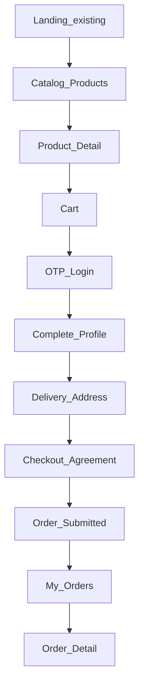

# مستند هم‌ترازی فرانت React با بک‌اند HyperAhan (فاز ۱)

> مخاطب: تیم/ایجنت React که **لندینگ و منوی ریسپانسیو** را دارد و باید بقیهٔ MVP را دقیقاً به API فعلی وصل کند.  
> مرجع بک‌اند: همین ریپو (`HyperAhan-Back`) — وضعیت: [`project-state.md`](project-state.md)  
> محصول: [`mvp-ahanalat.md`](mvp-ahanalat.md)

JSON همهٔ فیلدها **camelCase** است (پیش‌فرض ASP.NET Core).

---

## ۱. هدف و محدوده

### داخل محدوده فرانت (فاز ۱)
- کاتالوگ محصول (لیست، فیلتر، جزئیات) با تک‌قیمت
- سبد خرید با قفل قیمت ۳۰ دقیقه‌ای
- ورود با OTP پیامکی + JWT
- تکمیل پروفایل (نام + کد ملی) و آدرس تحویل
- ثبت سفارش مسیر «کارشناسی» + چک‌باکس توافق‌نامه
- پنل مشتری: لیست و جزئیات سفارش + وضعیت/حمل
- (اختیاری) پنل ادمین حداقلی برای رساندن سفارش به `Completed`

### خارج از محدوده
پرداخت آنلاین، دو قیمت، موجودی، ماشین‌حساب وزن، امضای دیجیتال، کیف پول — طبق MVP.

### فرض
صفحه لندینگ و منوی ریسپانسیو از قبل وجود دارد؛ این سند بقیهٔ صفحات و قرارداد API را قفل می‌کند.

---

## ۲. اتصال به API

| مورد | مقدار |
|---|---|
| Base URL توسعه | `http://localhost:5062` |
| HTTPS جایگزین | `https://localhost:7202` |
| Swagger | `http://localhost:5062/swagger` (فقط Development) |
| Content-Type | `application/json` |
| Auth header | `Authorization: Bearer <accessToken>` |

### CORS
بک‌اند **فعلاً CORS ندارد**. برای فرانت روی پورت دیگر (مثلاً Vite `5173`):

**Vite** — در `vite.config.ts`:
```ts
server: {
  proxy: {
    '/api': {
      target: 'http://localhost:5062',
      changeOrigin: true,
    },
  },
}
```
سپس در فرانت `baseURL: ''` یا `'/api'` نسبی بزنید تا درخواست‌ها از همان origin بروند.

---

## ۳. قرارداد پاسخ `OperationResult`

همهٔ APIهای کسب‌وکار این envelope را برمی‌گردانند:

**موفق:**
```json
{
  "isSuccess": true,
  "result": { },
  "errors": [],
  "statusCode": 200
}
```

**ناموفق:**
```json
{
  "isSuccess": false,
  "result": null,
  "errors": [
    {
      "message": "متن خطای فارسی",
      "errorCode": null,
      "type": 1
    }
  ],
  "statusCode": 400
}
```

`type` معمولاً عدد enum است: `0=General`, `1=Validation`, `2=NotFound`, `3=Conflict`, `4=Unauthorized`, `5=Forbidden`.

### قانون حیاتی فرانت
کنترلرها اغلب کل `OperationResult` را با HTTP 200 برمی‌گردانند حتی وقتی `isSuccess === false`.  
**همیشه `isSuccess` را چک کنید**؛ پیام را از `errors[0].message` نشان دهید.  
HTTP واقعی `401`/`403` فقط وقتی JWT نباشد/نقش اشتباه باشد (middleware).

نمونه کلاینت:
```ts
async function api<T>(res: Response): Promise<T> {
  if (res.status === 401) throw new Error('Unauthorized');
  const body = await res.json();
  if (!body.isSuccess) {
    throw new Error(body.errors?.[0]?.message ?? 'خطا');
  }
  return body.result as T;
}
```

---

## ۴. نقشه صفحات (روی لندینگ موجود)



| صفحه | مسیر پیشنهادی | نیاز به JWT | API اصلی |
|---|---|---|---|
| لندینگ (موجود) | `/` | خیر | اختیاری اسلایدر |
| لیست محصولات | `/products` | خیر | `GET /api/catalog/products` |
| جزئیات محصول | `/products/:id` | خیر | `GET /api/catalog/products/{id}` |
| سبد | `/cart` | خیر | cart |
| ورود OTP | `/auth` | خیر | otp send/verify |
| تکمیل پروفایل | `/me/profile` | بله | `POST/PUT /api/me/profile` |
| آدرس‌ها | `/me/addresses` | بله | addresses |
| تسویه | `/checkout` | بله | `POST /api/ordering/orders` |
| سفارش‌های من | `/orders` | بله | `GET /api/ordering/orders` |
| جزئیات سفارش | `/orders/:id` | بله | `GET /api/ordering/orders/{id}` |
| ادمین | `/admin/...` | Admin | بخش ۹ |

منو: لینک به محصولات، سبد (با badge تعداد)، ورود/حساب، سفارش‌های من (بعد از لاگین). دکمه ثابت «تماس با ما» طبق MVP.

---

## ۵. فلوی کسب‌وکار (اجباری — عین بک‌اند)

1. **بدون لاگین** محصول ببیند و به سبد بگذارد (`sessionToken`).
2. هنگام تسویه / ثبت سفارش → **OTP** → ذخیره `accessToken` (اعتبار ~۷ روز).
3. اگر `isProfileComplete === false` → فرم پروفایل (حقیقی: `nationalId` الزامی).
4. حداقل یک **آدرس تحویل**؛ `deliveryAddressId` را برای سفارش نگه دارید.
5. چک‌باکس توافق‌نامه → فقط وقتی تیک خورد `agreementAccepted: true` بفرستید.  
   متن توافق‌نامه **ثابت سمت فرانت** است؛ بک‌اند فقط `Agreement:Version = "v1"` را ذخیره می‌کند.
6. `POST /api/ordering/orders` با `cartId` + `deliveryAddressId` + `agreementAccepted`.
7. پیام موفقیت: «سفارش ثبت شد؛ کارشناس با شما تماس می‌گیرد.»
8. پیگیری در `/orders` و `/orders/:id` (وضعیت + حمل در صورت وجود).

### وضعیت سفارش برای UI

| مقدار API | برچسب پیشنهادی UI |
|---|---|
| `Submitted` | ثبت شده — در انتظار تماس |
| `InReview` | در حال بررسی کارشناس |
| `Confirmed` | تأیید شده — آماده ارسال |
| `Completed` | تکمیل / تحویل |
| `Cancelled` | لغو شده |

---

## ۶. مرجع API مشتری

### ۶.۱ کاتالوگ (عمومی)

#### `GET /api/catalog/categories`
```json
{ "id": "guid", "name": "میلگرد", "slug": "milgerd" }
```
`result` = آرایه.

#### `GET /api/catalog/factories` / `GET /api/catalog/brands`
```json
{ "id": "guid", "name": "..." }
```

#### `GET /api/catalog/products`
Query: `categoryId`, `factoryId`, `searchTerm`, `page` (پیش‌فرض ۱)، `pageSize` (پیش‌فرض ۲۰، حداکثر ۱۰۰).

`result`:
```json
{
  "items": [
    {
      "id": "guid",
      "name": "میلگرد ۱۴ آجدار",
      "categoryName": "میلگرد",
      "factoryName": "ذوب‌آهن اصفهان",
      "brandName": "ذوب‌آهن",
      "unit": "Ton",
      "currentPrice": 42500000
    }
  ],
  "pageNumber": 1,
  "pageSize": 20,
  "totalCount": 2,
  "totalPages": 1,
  "hasPreviousPage": false,
  "hasNextPage": false
}
```
`unit`: `"Kg"` | `"Ton"` | `"Piece"`.

#### `GET /api/catalog/products/{id}`
همان آبجکت آیتم لیست داخل `result`.

---

### ۶.۲ احراز هویت OTP (عمومی)

#### `POST /api/auth/otp/send`
```json
{ "phoneNumber": "09121234567" }
```
قوانین: فرمت `09` + ۹ رقم؛ cooldown ۶۰ ثانیه بین دو ارسال؛ اعتبار کد ۲ دقیقه.

`result`:
```json
{
  "success": true,
  "expiresAt": "2026-07-10T14:02:00Z",
  "debugCode": "12345"
}
```
`debugCode` فقط در Development وقتی `Otp:ExposeCodeInResponse=true` — برای تست دستی؛ در پروداکشن null/غایب است.

#### `POST /api/auth/otp/verify`
```json
{ "phoneNumber": "09121234567", "code": "12345" }
```
`result`:
```json
{
  "userId": "guid",
  "isNewUser": true,
  "isProfileComplete": false,
  "accessToken": "eyJ..."
}
```
بعد از موفقیت: `accessToken` و `userId` و `isProfileComplete` را در storage ذخیره کنید. نقش JWT: `Customer`.

---

### ۶.۳ پروفایل و آدرس (`[Authorize]`)

#### `GET /api/me`
```json
{
  "userId": "guid",
  "phoneNumber": "09121234567",
  "isPhoneVerified": true,
  "isProfileComplete": true,
  "fullName": "علی رضایی",
  "nationalId": "0013542419",
  "companyRegistrationId": null,
  "personType": "Individual",
  "profileAddress": null,
  "deliveryAddresses": []
}
```

#### `POST /api/me/profile` — تکمیل اولیه (یک‌بار)
```json
{
  "fullName": "علی رضایی",
  "nationalId": "0013542419",
  "personType": 1,
  "companyRegistrationId": null,
  "address": null
}
```
- `personType`: `1` = Individual (پیش‌فرض)، `2` = Company  
- حقیقی → `nationalId` الزامی (۱۰ رقم + الگوریتم)  
- حقوقی → `companyRegistrationId` الزامی  
- تکرار → Conflict

#### `PUT /api/me/profile` — ویرایش بعد از تکمیل
```json
{
  "fullName": "علی رضایی",
  "nationalId": "0013542419",
  "companyRegistrationId": null,
  "address": {
    "province": "تهران",
    "city": "تهران",
    "street": "خیابان آزادی پلاک ۱۲",
    "postalCode": "1234567890"
  }
}
```

#### آدرس تحویل
- `GET /api/me/addresses`
- `POST /api/me/addresses`
- `PUT /api/me/addresses/{addressId}`
- `DELETE /api/me/addresses/{addressId}`

بدنه افزودن:
```json
{
  "recipientName": "علی رضایی",
  "recipientPhone": "09121234567",
  "address": {
    "province": "تهران",
    "city": "تهران",
    "street": "خیابان آزادی پلاک ۱۲",
    "postalCode": "1234567890"
  },
  "isDefault": true
}
```
قوانین: تلفن گیرنده مثل موبایل؛ کد پستی ۱۰ رقم؛ خیابان حداقل ۱۰ کاراکتر. اولین آدرس در صورت نیاز خودکار پیش‌فرض می‌شود.

پاسخ آدرس:
```json
{
  "id": "guid",
  "recipientName": "...",
  "recipientPhone": "...",
  "address": { "province": "", "city": "", "street": "", "postalCode": "" },
  "isDefault": true
}
```

---

### ۶.۴ سبد (عمومی — بدون JWT)

#### `POST /api/ordering/cart/items`
```json
{
  "cartId": null,
  "sessionToken": "550e8400-e29b-41d4-a716-446655440000",
  "productId": "guid",
  "quantity": 2
}
```
- اولین بار: `sessionToken` الزامی (کلاینت UUID بسازد) یا بعداً `cartId`.
- یکی از `cartId` یا `sessionToken` باید باشد.
- قیمت در لحظهٔ افزودن **قفل** می‌شود؛ افزودن مجدد همان محصول فقط `quantity` را جمع می‌کند و قیمت قفل‌شده قبلی را عوض نمی‌کند.
- انقضا: ۳۰ دقیقه از ساخت سبد (`expiresAt`).

`result`:
```json
{
  "cartId": "guid",
  "expiresAt": "2026-07-10T14:30:00Z",
  "items": [
    {
      "id": "guid",
      "productId": "guid",
      "quantity": 2,
      "lockedUnitPrice": 42500000
    }
  ],
  "totalEstimate": 85000000
}
```

#### `GET /api/ordering/cart/{cartId}`
همان شکل. اگر منقضی باشد → خطا.

**UX:** شمارش معکوس تا `expiresAt`؛ بعد از انقضا با همان `sessionToken` دوباره add کنید (سبد جدید + قیمت جدید).

---

### ۶.۵ سفارش مشتری (`[Authorize]` نقش Customer)

#### `POST /api/ordering/orders`
```json
{
  "cartId": "guid",
  "deliveryAddressId": "guid",
  "agreementAccepted": true
}
```

گیت‌های سرور (پیام‌های تقریبی فارسی):
| شرط | خطا |
|---|---|
| `agreementAccepted !== true` | پذیرش توافق‌نامه الزامی است |
| پروفایل ناقص | ابتدا پروفایل خود را تکمیل کنید |
| آدرس نامعتبر / مال کاربر دیگر | آدرس تحویل معتبر نیست |
| سبد خالی/منقضی/ناموجود | پیام مربوطه |
| محصول سبد از کاتالوگ رفته | برخی محصولات سبد دیگر در کاتالوگ موجود نیستند |

بعد از موفقیت سرور سبد را expire می‌کند → `cartId` را از storage پاک کنید.

`result` = `OrderDetailDto` (نمونه زیر).

#### `GET /api/ordering/orders`
`result` = آرایه:
```json
{
  "id": "guid",
  "orderNumber": "HA-20260710-12345",
  "status": "Submitted",
  "totalEstimatedAmount": 85000000,
  "submittedAt": "..."
}
```

#### `GET /api/ordering/orders/{id}`
```json
{
  "id": "guid",
  "orderNumber": "HA-20260710-12345",
  "status": "Confirmed",
  "totalEstimatedAmount": 85000000,
  "finalAmount": 82000000,
  "submittedAt": "...",
  "confirmedAt": "...",
  "completedAt": null,
  "cancelledAt": null,
  "cancelReason": null,
  "agreementVersion": "v1",
  "agreementAcceptedAt": "...",
  "recipientName": "...",
  "recipientPhone": "...",
  "deliveryAddress": "تهران، ...",
  "items": [
    {
      "id": "guid",
      "productId": "guid",
      "productName": "میلگرد ۱۴ آجدار",
      "quantity": 2,
      "unitPriceAtOrder": 42500000,
      "lineTotal": 85000000
    }
  ],
  "shipping": {
    "driverName": "...",
    "driverPhone": "...",
    "vehiclePlate": "...",
    "vehicleDescription": null,
    "registeredAt": "..."
  },
  "statusHistory": [
    {
      "fromStatus": null,
      "toStatus": "Submitted",
      "changedAt": "...",
      "note": "ثبت سفارش"
    }
  ],
  "adminNotes": null
}
```
برای مشتری `adminNotes` همیشه `null` است. `shipping` تا قبل از ثبت حمل توسط ادمین `null` است.

---

### ۶.۶ اسلایدر لندینگ (اختیاری، عمومی)

1. `GET /api/slider-groups/by-slug/{slug}` → `id` گروه  
2. `GET /api/sliders/group/{groupId}/active` → اسلایدهای فعال  

اگر گروه/داده seed نشده، لندینگ استاتیک فعلی کافی است.

---

## ۷. State سمت کلاینت

پیشنهاد کلیدهای `localStorage` (یا معادل امن‌تر):

| کلید | توضیح |
|---|---|
| `ha_sessionToken` | UUID پایدار برای سبد ناشناس |
| `ha_cartId` | بعد از اولین add |
| `ha_cartExpiresAt` | ISO از پاسخ سبد |
| `ha_accessToken` | JWT مشتری |
| `ha_userId` | از verify |
| `ha_isProfileComplete` | از verify / GET /me |

### رفتار
- قبل از add: اگر `sessionToken` نیست بسازید.
- بعد از add: `cartId` و `expiresAt` را به‌روز کنید.
- بعد از verify: توکن را ذخیره؛ اگر پروفایل ناقص → هدایت به `/me/profile`.
- بعد از submit موفق: `ha_cartId` / `ha_cartExpiresAt` را پاک کنید؛ `sessionToken` می‌تواند بماند.
- روی `401`: توکن را پاک و به `/auth` بروید.

---

## ۸. چک‌لیست پذیرش فرانت (MVP)

- [ ] از لندینگ موبایل به لیست محصول می‌رود و فیلتر/جستجو کار می‌کند
- [ ] افزودن به سبد قیمت قفل‌شده و تایمر انقضا را نشان می‌دهد
- [ ] OTP ارسال/تأیید و ذخیره JWT
- [ ] پروفایل + آدرس تکمیل می‌شود
- [ ] توافق‌نامه بدون تیک، submit را بلاک می‌کند (UI + سرور)
- [ ] سفارش `Submitted` ثبت می‌شود و پیام کارشناس نمایش داده می‌شود
- [ ] در «سفارش‌های من» وضعیت تا `Completed` و اطلاعات حمل دیده می‌شود
- [ ] خطاها از `errors[].message` به فارسی نمایش داده می‌شوند
- [ ] proxy/CORS طوری است که در dev بدون خطای مرورگر کار می‌کند

---

## ۹. پیوست — پنل ادمین حداقلی

### ورود
`POST /api/auth/admin/login`
```json
{ "username": "admin", "password": "Admin@12345" }
```
`result`: `{ "adminId": "guid", "accessToken": "..." }`  
نقش JWT: `Admin`. هدر همان Bearer.

> مقادیر پیش‌فرض از `AdminAuth` در `appsettings.json` — در پروداکشن عوض شوند.

### APIها (`[Authorize(Roles = "Admin")]`)

| Method | Path | توضیح |
|---|---|---|
| `GET` | `/api/admin/orders?status=&fromUtc=&toUtc=&page=1&pageSize=20` | لیست صفحه‌بندی‌شده |
| `GET` | `/api/admin/orders/{id}` | جزئیات + `adminNotes` |
| `PATCH` | `/api/admin/orders/{id}/status` | تغییر وضعیت |
| `POST` | `/api/admin/orders/{id}/notes` | یادداشت |
| `POST` | `/api/admin/orders/{id}/shipping` | ثبت حمل |

#### تغییر وضعیت
```json
{
  "targetStatus": "InReview",
  "cancelReason": null,
  "finalAmount": null
}
```

| هدف | از وضعیت | فیلد اضافه |
|---|---|---|
| `InReview` | `Submitted` | — |
| `Confirmed` | `InReview` | `finalAmount` اختیاری ولی اگر باشد باید > 0 |
| `Cancelled` | Submitted / InReview / Confirmed | `cancelReason` **اجباری** |
| `Completed` | `Confirmed` | فقط بعد از ثبت shipping |

#### حمل
```json
{
  "driverName": "راننده",
  "driverPhone": "09120000000",
  "vehiclePlate": "12ب34567",
  "vehicleDescription": "خاور"
}
```
فقط یک‌بار و فقط وقتی `Confirmed`.

مسیر شاد:  
`Submitted` → `InReview` → `Confirmed` → shipping → `Completed`

---

## ۱۰. ایندکس فایل‌های بک‌اند (برای دیباگ)

| موضوع | مسیر |
|---|---|
| Auth | `WebApi/Controllers/User/AuthController.cs` |
| Me | `WebApi/Controllers/User/MeController.cs` |
| Catalog | `WebApi/Controllers/Catalog/` |
| Cart / Orders / Admin | `WebApi/Controllers/Ordering/` |
| Cart DTOs | `OrderingModule.Application/DTOs/CartDtos.cs` |
| Order DTOs | `OrderingModule.Application/DTOs/OrderDtos.cs` |
| Portal DTOs | `UserModule.Application/DTOs/CustomerPortalDtos.cs` |
| OperationResult | `Common.Application/ResponseUtils/OperationResult.cs` |
| Config | `WebApi/appsettings.json` |

---

## ۱۱. دستور کار برای ایجنت React

1. proxy به `http://localhost:5062` بگذار.
2. لایه `apiClient` با چک `isSuccess` بساز.
3. صفحات جدول بخش ۴ را به ترتیب Catalog → Cart → Auth → Profile → Address → Checkout → Orders پیاده کن.
4. state بخش ۷ را رعایت کن.
5. متن توافق‌نامه ثابت UI با نسخه منطقی `v1` هم‌خوان باشد.
6. با چک‌لیست بخش ۸ تست دستی کن؛ در Dev برای OTP از `debugCode` استفاده کن.
7. پنل ادمین را فقط اگر لازم است طبق بخش ۹ اضافه کن.

**معیار موفقیت:** یک کاربر موبایل از لندینگ تا سفارش `Submitted` برسد و بعد از کار ادمین، وضعیت `Completed` را در پنل خودش ببیند.
