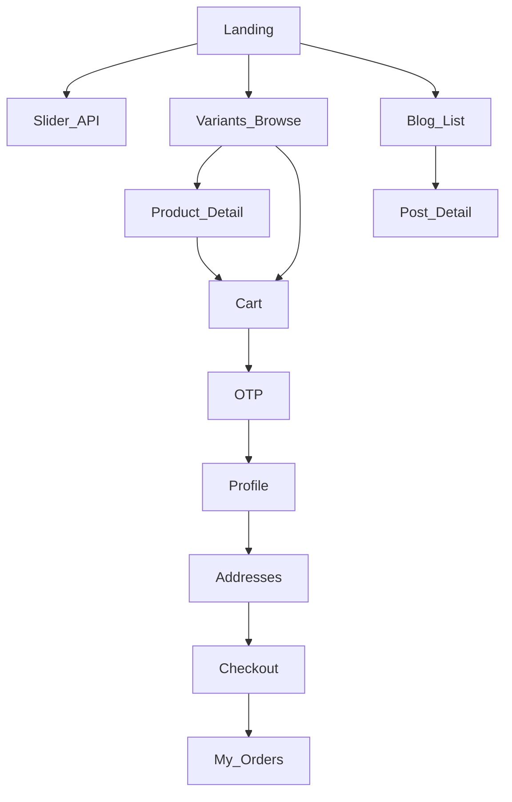

# مستند هم‌ترازی فرانت React با بک‌اند HyperAhan

> مخاطب: تیم/ایجنت React برای اتصال فرانت به API واقعی همین ریپو.  
> وضعیت بک‌اند: [`project-state.md`](project-state.md) · محصول: [`mvp-ahanalat.md`](mvp-ahanalat.md)  
> **کاتالوگ (منو، فیلتر، محصولات):** [`frontend-catalog-integration.md`](frontend-catalog-integration.md)  
> **لاگین / UserModule (OTP، پروفایل، آدرس):** [`frontend-auth-integration.md`](frontend-auth-integration.md)  
> **بلاگ / BlogModule (SEO-first):** [`BlogModule_frontend_integration.md`](BlogModule_frontend_integration.md)  
> **اسلایدر / SliderModule:** [`SliderModule_frontend_integration.md`](SliderModule_frontend_integration.md)  
> **فایل / FileModule (`FileDto`):** [`FileModule_frontend_integration.md`](FileModule_frontend_integration.md)  
> همهٔ فیلدهای JSON **camelCase** هستند (پیش‌فرض ASP.NET Core).

این سند از روی کنترلرها و DTOهای فعلی نوشته شده؛ اگر Swagger با این متن فرق داشت، Swagger/`Controllers` مرجع نهایی است.

---

## ۱. هدف و محدوده

### هستهٔ خرید (مسیر اجباری MVP)
- کاتالوگ واریانت (browse/filter) + جزئیات محصول مادر
- سبد با قفل قیمت ۳۰ دقیقه‌ای (`productVariantId`)
- OTP + JWT مشتری
- پروفایل + آدرس تحویل
- ثبت سفارش کارشناسی + توافق‌نامه
- پنل مشتری: سفارش‌ها و وضعیت/حمل
- (اختیاری) پنل ادمین حداقلی تا `Completed`

### محتوا و لندینگ (موجود در بک‌اند — در پروژه MVP نگه دارید)
- **اسلایدر** لندینگ (`/api/slider-groups`, `/api/sliders`)
- **بلاگ** — عمومی `api/blog/...` · ادمین `api/admin/blog/...` · اولویت SEO ([`BlogModule_frontend_integration.md`](BlogModule_frontend_integration.md))

این دو ماژول seed ندارند؛ اگر داده خالی بود UI استاتیک/خالی بگذارید، ولی مسیر API و صفحات را در فرانت داشته باشید.

### خارج از محدوده
پرداخت آنلاین، دو قیمت، موجودی انبار، ماشین‌حساب وزن، امضای دیجیتال، کیف پول.

---

## ۲. اتصال به API

| مورد | مقدار |
|---|---|
| Base URL توسعه | `http://localhost:5062` |
| HTTPS | `https://localhost:7202` |
| Swagger | `http://localhost:5062/swagger` (فقط Development) |
| Content-Type | `application/json` (جز آپلود Form در بلاگ/اسلایدر ادمین) |
| Auth | `Authorization: Bearer <accessToken>` |

### CORS
بک‌اند **CORS ندارد**. برای Vite روی پورت دیگر:

```ts
// vite.config.ts
server: {
  proxy: {
    '/api': { target: 'http://localhost:5062', changeOrigin: true },
    '/uploads': { target: 'https://localhost:7202', changeOrigin: true, secure: false }, // FileModule
  },
}
```

در کلاینت `baseURL` را خالی یا نسبی بگذارید تا از همان origin پروکسی شود.

### تصاویر استاتیک (`FileDto`)
همهٔ ماژول‌های محتوایی تصویر را به‌صورت `FileDto` برمی‌گردانند (`url` / `thumbnailUrl` معمولاً **absolute**). جزئیات: [`FileModule_frontend_integration.md`](FileModule_frontend_integration.md).

| ماژول | فیلد JSON | مسیر ذخیره |
|---|---|---|
| اسلایدر | `image` / `mobileImage` | `uploads/slider/...` |
| بلاگ | `image` | `uploads/blog/...` |
| کاتالوگ | `image` | `uploads/catalog/...` |

---

## ۳. قرارداد `OperationResult`

همهٔ APIهای کسب‌وکار این envelope را برمی‌گردانند:

```json
{
  "isSuccess": true,
  "result": { },
  "errors": [],
  "statusCode": 200
}
```

ناموفق:
```json
{
  "isSuccess": false,
  "result": null,
  "errors": [{ "message": "متن فارسی", "errorCode": null, "type": 1 }],
  "statusCode": 400
}
```

`errors[].type`: `0=General`, `1=Validation`, `2=NotFound`, `3=Conflict`, `4=Unauthorized`, `5=Forbidden` (عدد، نه رشته).

### HTTP status (به‌روز شد)
کنترلرهای **Blog** الان `OperationResult` را با **همان HTTP status واقعی** برمی‌گردانند (`200` / `201` / `400` / `404` / `409` / `301`).  
همیشه هم `res.ok` / status و هم `isSuccess` را چک کنید.

- مقاله با slug قدیمی (`canonicalSlug`): **HTTP 301** + هدر `Location: /api/blog/posts/by-slug/{newSlug}` + body شامل پست فعلی
- پیش‌نویس / یافت‌نشد: **HTTP 404**
- لیست‌های صفحه‌بندی‌شده: هدر `Link` با `rel="prev"` / `rel="next"` وقتی صفحهٔ مجاور وجود دارد

```ts
async function api<T>(res: Response): Promise<T> {
  if (res.status === 401) throw new Error('Unauthorized');
  if (res.status === 403) throw new Error('Forbidden');
  if (res.status === 301) {
    const loc = res.headers.get('Location');
    // follow to new slug or use body.result.slug
  }
  const body = await res.json();
  if (!body.isSuccess) {
    throw new Error(body.errors?.[0]?.message ?? 'خطا');
  }
  return body.result as T;
}
```

### صفحه‌بندی کاتالوگ / بلاگ جستجو
```json
{
  "items": [],
  "pageNumber": 1,
  "pageSize": 20,
  "totalCount": 0,
  "totalPages": 0,
  "hasPreviousPage": false,
  "hasNextPage": false
}
```

لیست ادمین سفارش‌ها شکل متفاوت دارد: `{ "items", "totalCount", "page", "pageSize" }`.

---

## ۴. نقشه صفحات



| صفحه | مسیر پیشنهادی | JWT | API اصلی |
|---|---|---|---|
| لندینگ | `/` | خیر | اسلایدر + لینک کاتالوگ/بلاگ |
| بازار (قابل‌خرید) | `/products` یا `/variants` | خیر | **`GET /api/catalog/variants?searchTerm=`** |
| جزئیات محصول | `/products/:slug` | خیر | **`GET /api/catalog/products/by-slug/{slug}`** (ترجیحی) یا `{id}` |
| دسته محصولات | `/products/category/:categorySlug` | خیر | `GET /api/catalog/products/by-category-slug/{slug}` |
| سبد | `/cart` | خیر | cart با `productVariantId` |
| بلاگ لیست | `/blog` | خیر | `GET /api/blog/posts/search` |
| بلاگ جزئیات | `/blog/:slug` | خیر | `GET /api/blog/posts/by-slug/{slug}` |
| ورود OTP | `/auth` | خیر | otp send/verify |
| پروفایل | `/me/profile` | Customer | `POST/PUT /api/user/me/profile` |
| آدرس‌ها | `/me/addresses` | Customer | addresses |
| تسویه | `/checkout` | Customer | `POST /api/ordering/orders` |
| سفارش‌های من | `/orders` | Customer | `GET /api/ordering/orders` |
| جزئیات سفارش | `/orders/:id` | Customer | `GET /api/ordering/orders/{id}` |
| ادمین سفارش | `/admin/orders` | Admin | بخش ۱۰ |

منو پیشنهادی: بازار، بلاگ، سبد (badge)، ورود/حساب، سفارش‌ها؛ دکمه ثابت «تماس با ما».

---

## ۵. فلوی خرید (اجباری)

1. بدون لاگین: browse واریانت → افزودن با `productVariantId` + `sessionToken` (UUID کلاینت).
2. تسویه → OTP → ذخیره `accessToken` (~۷ روز)، نقش JWT: `Customer`.
3. اگر `isProfileComplete === false` → `POST /api/user/me/profile` (حقیقی: `nationalId` الزامی).
4. حداقل یک آدرس؛ `deliveryAddressId` را برای submit نگه دارید.
5. چک‌باکس توافق‌نامه → فقط با تیک: `agreementAccepted: true`.  
   متن توافق‌نامه **ثابت سمت فرانت**؛ بک‌اند فقط `Agreement:Version = "v1"` را ذخیره می‌کند.
6. `POST /api/ordering/orders` با `cartId` + `deliveryAddressId` + `agreementAccepted`.
7. پیام: «سفارش ثبت شد؛ کارشناس با شما تماس می‌گیرد.» سپس سبد را از storage پاک کنید.
8. پیگیری در `/orders`.

### وضعیت سفارش

| API | برچسب UI |
|---|---|
| `Submitted` | ثبت شده — در انتظار تماس |
| `InReview` | در حال بررسی کارشناس |
| `Confirmed` | تأیید شده — آماده ارسال |
| `Completed` | تکمیل / تحویل |
| `Cancelled` | لغو شده |

---

## ۶. کاتالوگ

> **سند کامل منو / فیلتر / browse / جزئیات / ادمین:** [`frontend-catalog-integration.md`](frontend-catalog-integration.md)

**واحد فروش = واریانت.** محصول مادر مستقیم به سبد نمی‌رود.

### نام فیلد واریانت (مهم)

| منبع | فیلد GUID واریانت |
|---|---|
| `GET /api/catalog/variants` → items | **`productVariantId`** |
| `GET /api/catalog/products/by-slug/{slug}` → `variants[]` | **`id`** (همان GUID) |
| `GET /api/catalog/products/{id}` → `variants[]` | **`id`** (همان GUID) |
| cart / order | **`productVariantId`** |

از جزئیات محصول، `variants[].id` را به‌عنوان `productVariantId` به سبد بفرستید.

### Lookups (عمومی)

| Method | Path | `result` |
|---|---|---|
| GET | `/api/catalog/categories` | `[{ id, name, slug, metaTitle, metaDescription }]` |
| GET | `/api/catalog/categories/by-slug/{slug}` | جزئیات دسته + `effectiveMeta*` |
| GET | `/api/catalog/factories` | `[{ id, name }]` |
| GET | `/api/catalog/brands` | `[{ id, name }]` |

> `/api/blog/categories` مال **بلاگ** است، نه فیلتر کاتالوگ.

### SEO / کشف در موتور جستجو (API)

| Method | Path | کاربرد |
|---|---|---|
| GET | `/api/catalog/products?searchTerm=میلگرد` | جستجوی نام/slug/توضیح/مشخصات/meta (ILike) |
| GET | `/api/catalog/products?categorySlug=rebar` | فیلتر دسته بدون Guid |
| GET | `/api/catalog/products/by-slug/{slug}` | صفحهٔ محصول SEO؛ slug قدیمی → **301** |
| GET | `/api/catalog/products/by-category-slug/{slug}` | لندینگ دسته |
| GET | `/api/catalog/products/sitemap` | دادهٔ sitemap محصولات فعال |
| GET | `/api/catalog/variants?searchTerm=...&categorySlug=` | جستجوی بازار |

جزئیات محصول برای فرانت: `effectiveMetaTitle`, `effectiveMetaDescription`, `imageUrl`, `canonicalSlug`, `specification`, `categorySlug`.

ادمین: `PATCH /api/admin/catalog/products/{id}/seo` و `.../slug`.

### `GET /api/catalog/variants` — browse اصلی بازار

Query: `categoryId`, `brandId`, `factoryId`, `productId`, `searchTerm`, `size`, `grade`, `thickness`, `standard`, `page` (۱)، `pageSize` (۲۰، max ۱۰۰).

فقط واریانت‌هایی برمی‌گردند که **قیمت فعال** دارند و محصول‌شان فعال است.

```json
{
  "items": [{
    "productVariantId": "guid",
    "productId": "guid",
    "productName": "میلگرد آجدار",
    "variantName": "۱۴ — A3",
    "displayName": "میلگرد آجدار — ۱۴ — A3",
    "sku": "...",
    "categoryName": "میلگرد",
    "brandName": "ذوب‌آهن",
    "factoryName": "ذوب‌آهن اصفهان",
    "unit": "Kg",
    "size": "14",
    "thickness": null,
    "grade": "A3",
    "standard": "ISIRI",
    "currentPrice": 41500
  }],
  "pageNumber": 1,
  "pageSize": 20,
  "totalCount": 54,
  "totalPages": 3,
  "hasPreviousPage": false,
  "hasNextPage": true
}
```

`unit` در seed فعلی: `"Kg"` (مشتری خرد). enum بک‌اند همچنین `"Ton"` | `"Piece"` را می‌پذیرد.

### `GET /api/catalog/products` — لیست مادر (خلاصه)

Query: `categoryId`, `brandId`, `searchTerm`, `page`, `pageSize`.

```json
{
  "id": "guid",
  "name": "...",
  "slug": "rebar",
  "categoryName": "میلگرد",
  "brandName": "...",
  "unit": "Kg",
  "variantCount": 6,
  "minPrice": 40500
}
```

قیمت خرید مستقیم ندارد؛ برای خرید یا به variants بروید یا به جزئیات.

### `GET /api/catalog/products/{id}` — جزئیات + انتخاب واریانت

```json
{
  "id": "guid",
  "name": "میلگرد آجدار",
  "slug": "rebar",
  "description": "...",
  "categoryName": "میلگرد",
  "brandName": "...",
  "unit": "Kg",
  "imageUrl": null,
  "variants": [{
    "id": "guid",
    "variantName": "۱۴ A3",
    "sku": "...",
    "factoryName": "ذوب‌آهن اصفهان",
    "size": "14",
    "thickness": null,
    "grade": "A3",
    "standard": "ISIRI",
    "length": "12m",
    "weight": null,
    "isDefault": true,
    "currentPrice": 41500
  }]
}
```

خطا: `"محصول مورد نظر یافت نشد."`

### Seed کاتالوگ (dev)

اگر DB خالی باشد روی startup پر می‌شود (~۹ دسته، ~۸ کارخانه، ~۱۲ محصول، ~۵۴ واریانت، Guid ثابت).  
**واحد همهٔ محصولات seed: `Kg`**؛ قیمت تقریبی تومان/کیلو.  
اگر seed قدیمی (با `Ton`) مانده، seed جدید skip می‌شود — برای دادهٔ جدید، جداول Catalog را wipe کنید یا DB را از نو بسازید.

نمونه Guid ثابت (برای تست دستی):
- دسته میلگرد: `10000000-0000-0000-0000-000000000001`
- کارخانه ذوب‌آهن: `20000000-0000-0000-0000-000000000001`
- محصول میلگرد: `40000000-0000-0000-0000-000000000001`
- واریانت پیش‌فرض میلگرد ۱۲: `50000000-0000-0000-0000-000000000001`

---

## ۷. اسلایدر

> **سند کامل (عمومی + ادمین + موارد استفاده فروشگاه/بلاگ/سایر صفحات):** [`SliderModule_frontend_integration.md`](SliderModule_frontend_integration.md)

Seed ندارد. فلوی لندینگ: `GET /api/slider-groups/by-slug/{slug}` → `GET /api/sliders/group/{groupId}/active`.

---

## ۸. بلاگ

> **سند کامل SEO-first (slug، 301، meta/OG/JSON-LD، sitemap، ادمین):** [`BlogModule_frontend_integration.md`](BlogModule_frontend_integration.md)

Seed ندارد. **اولویت ماژول = SEO** (URL با slug، پیش‌نویس نامرئی، 301 روی تغییر slug).

| لایه | Prefix | کنترلر |
|---|---|---|
| عمومی | `api/blog/...` | `Controllers/Blog/PostsController` · `CategoriesController` |
| ادمین | `api/admin/blog/...` | `AdminPostsController` · `AdminCategoriesController` |

### عمومی (خلاصه)
| Method | Path |
|---|---|
| GET | `/api/blog/posts/by-slug/{slug}` — 200 / **301** / 404 |
| GET | `/api/blog/posts/search` · `latest` · `most-visited` · `best` · `sitemap` |
| GET | `/api/blog/posts/by-category-slug/{slug}` (ترجیحی برای SEO) |
| GET | `/api/blog/categories` · `/by-slug/{slug}` |

برای `<title>` / OG از `effectiveMetaTitle` و `effectiveMetaDescription`؛ تصویر: `{API_ORIGIN}/{imageUrl}`.

### ادمین (خلاصه — Bearer Admin)
| Method | Path |
|---|---|
| POST / PUT / DELETE | `/api/admin/blog/posts` (FormData + `body`) |
| GET | `/api/admin/blog/posts/{id}` · `/search` (پیش‌نویس؛ noindex) |
| PATCH | `/api/admin/blog/posts/{id}/seo` · `/slug` · `/publish` · `/unpublish` |
| POST / PUT / DELETE | `/api/admin/blog/categories` |

---

## ۹. احراز هویت

> **سند کامل OTP / JWT / پروفایل / آدرس / ادمین login:** [`frontend-auth-integration.md`](frontend-auth-integration.md)

### `POST /api/user/auth/otp/send`
```json
{ "phoneNumber": "09121234567" }
```
فرمت: موبایل ایران (`09…`؛ `+98`/`98` هم قبول می‌شود). Cooldown ۶۰ث؛ اعتبار کد ۲ دقیقه.

```json
{ "success": true, "expiresAt": "...", "debugCode": "12345" }
```
`debugCode` فقط وقتی `Otp:ExposeCodeInResponse=true` (Development).

#### کاربران seed (Dev)
اگر جدول Users خالی باشد روی startup این شماره‌ها ساخته می‌شوند. OTP بفرستید → `debugCode` → verify:

| موبایل | سناریو بعد از verify |
|---|---|
| `09121111111` | پروفایل ناقص (`isProfileComplete: false`) |
| `09122222222` | پروفایل حقیقی کامل، بدون آدرس تحویل |
| `09123333333` | آماده سفارش (حقیقی + آدرس پیش‌فرض `a2000000-…0001`) |
| `09124444444` | آماده سفارش حقوقی + آدرس |
| `09125555555` | دو آدرس تحویل |
| `09126666666` | کاربر غیرفعال (`IsActive=false`) — OTP فعلاً توکن می‌دهد |
| `09129999999` | سید نشده → کاربر کاملاً جدید |

ادمین: `POST /api/user/auth/admin/login` با `admin` / `Admin@12345` (از `AdminAuth`).

خطای رایج: `"لطفاً ۶۰ ثانیه صبر کنید و دوباره تلاش کنید."`

### `POST /api/user/auth/otp/verify`
```json
{ "phoneNumber": "09121234567", "code": "12345" }
```
```json
{
  "userId": "guid",
  "isNewUser": true,
  "isProfileComplete": false,
  "accessToken": "eyJ..."
}
```
نقش JWT: `Customer`. Claim شناسه کاربر: `NameIdentifier` / `sub`.

### `POST /api/user/auth/admin/login`
```json
{ "username": "admin", "password": "Admin@12345" }
```
```json
{ "adminId": "aaaaaaaa-aaaa-aaaa-aaaa-aaaaaaaaaaaa", "accessToken": "..." }
```
نقش: `Admin`. مقادیر از `AdminAuth` در `appsettings.json`.

---

## ۱۰. پروفایل و آدرس (`[Authorize]` Customer)

### `GET /api/user/me`
```json
{
  "userId": "guid",
  "phoneNumber": "09121234567",
  "isPhoneVerified": true,
  "isProfileComplete": true,
  "fullName": "علی رضایی",
  "nationalId": "0013542419",
  "companyRegistrationId": null,
  "personType": "Individual",
  "profileAddress": null,
  "deliveryAddresses": []
}
```
`personType` در پاسخ **رشته** است: `"Individual"` | `"Company"`.

### `POST /api/user/me/profile` — تکمیل اولیه (یک‌بار)
```json
{
  "fullName": "علی رضایی",
  "nationalId": "0013542419",
  "personType": 1,
  "companyRegistrationId": null,
  "address": null
}
```
- درخواست: `personType` عدد enum — `1=Individual` (پیش‌فرض)، `2=Company`
- حقیقی → `nationalId` الزامی؛ حقوقی → `companyRegistrationId` الزامی

### `PUT /api/user/me/profile` — بعد از تکمیل
```json
{
  "fullName": "علی رضایی",
  "nationalId": "0013542419",
  "companyRegistrationId": null,
  "address": null
}
```

### آدرس‌ها
- `GET /api/user/me/addresses`
- `POST /api/user/me/addresses`
- `PUT /api/user/me/addresses/{addressId}`
- `DELETE /api/user/me/addresses/{addressId}`

```json
{
  "recipientName": "علی رضایی",
  "recipientPhone": "09121234567",
  "address": {
    "province": "تهران",
    "city": "تهران",
    "street": "خیابان آزادی پلاک ۱۲",
    "postalCode": "1234567890"
  },
  "isDefault": true
}
```
تلفن گیرنده مثل موبایل؛ کد پستی ۱۰ رقم؛ خیابان حداقل ۱۰ کاراکتر.

پاسخ آدرس:
```json
{
  "id": "guid",
  "recipientName": "...",
  "recipientPhone": "...",
  "address": { "province": "", "city": "", "street": "", "postalCode": "" },
  "isDefault": true
}
```

---

## ۱۱. سبد (عمومی — بدون JWT)

### `POST /api/ordering/cart/items`
```json
{
  "cartId": null,
  "sessionToken": "550e8400-e29b-41d4-a716-446655440000",
  "productVariantId": "guid",
  "quantity": 2
}
```
- یکی از `cartId` یا `sessionToken` الزامی
- `productVariantId` الزامی (نه `productId`)
- قیمت لحظهٔ افزودن قفل می‌شود؛ تکرار همان واریانت فقط `quantity` را جمع می‌کند
- TTL: ۳۰ دقیقه (`expiresAt`)

```json
{
  "cartId": "guid",
  "expiresAt": "2026-07-11T14:30:00Z",
  "items": [{
    "id": "guid",
    "productVariantId": "guid",
    "quantity": 2,
    "lockedUnitPrice": 41500
  }],
  "totalEstimate": 83000
}
```

### `GET /api/ordering/cart/{cartId}`
همان شکل. منقضی → خطا.

خطاهای مهم:
- `"شناسه واریانت محصول الزامی است."`
- `"این واریانت در حال حاضر قابل سفارش نیست."`
- `"سبد خرید منقضی شده است."`

---

## ۱۲. سفارش مشتری (`[Authorize]` Customer)

### `POST /api/ordering/orders`
```json
{
  "cartId": "guid",
  "deliveryAddressId": "guid",
  "agreementAccepted": true
}
```

| شرط | خطا تقریبی |
|---|---|
| بدون توافق | پذیرش توافق‌نامه الزامی است |
| پروفایل ناقص | ابتدا پروفایل خود را تکمیل کنید |
| آدرس نامعتبر | آدرس تحویل معتبر نیست |
| واریانت رفته | برخی واریانت‌های سبد دیگر در کاتالوگ موجود نیستند |

بعد از موفقیت سبد expire می‌شود → `cartId` را پاک کنید.

### `GET /api/ordering/orders` / `GET /api/ordering/orders/{id}`

لیست:
```json
{
  "id": "guid",
  "orderNumber": "HA-20260711-12345",
  "status": "Submitted",
  "totalEstimatedAmount": 83000,
  "submittedAt": "..."
}
```

جزئیات (خلاصه فیلدها):
```json
{
  "id": "guid",
  "orderNumber": "HA-20260711-12345",
  "status": "Confirmed",
  "totalEstimatedAmount": 83000,
  "finalAmount": 80000,
  "submittedAt": "...",
  "confirmedAt": "...",
  "completedAt": null,
  "cancelledAt": null,
  "cancelReason": null,
  "agreementVersion": "v1",
  "agreementAcceptedAt": "...",
  "recipientName": "...",
  "recipientPhone": "...",
  "deliveryAddress": "تهران، ...",
  "items": [{
    "id": "guid",
    "productVariantId": "guid",
    "productName": "میلگرد — ۱۴ A3",
    "quantity": 2,
    "unitPriceAtOrder": 41500,
    "lineTotal": 83000
  }],
  "shipping": {
    "driverName": "...",
    "driverPhone": "...",
    "vehiclePlate": "...",
    "vehicleDescription": null,
    "registeredAt": "..."
  },
  "statusHistory": [{
    "fromStatus": null,
    "toStatus": "Submitted",
    "changedAt": "...",
    "note": "ثبت سفارش"
  }],
  "adminNotes": null
}
```
برای مشتری `adminNotes` همیشه `null` است. `shipping` تا قبل از ثبت حمل `null` است.

---

## ۱۳. State سمت کلاینت

| کلید | توضیح |
|---|---|
| `ha_sessionToken` | UUID پایدار سبد ناشناس |
| `ha_cartId` | بعد از اولین add |
| `ha_cartExpiresAt` | ISO از پاسخ سبد |
| `ha_accessToken` | JWT مشتری |
| `ha_userId` | از verify |
| `ha_isProfileComplete` | از verify / GET /me |
| `ha_adminToken` | فقط پنل ادمین |

رفتار:
- قبل از add: اگر `sessionToken` نیست بسازید
- بعد از verify: اگر پروفایل ناقص → `/me/profile`
- بعد از submit موفق: `cartId` / `expiresAt` را پاک کنید؛ `sessionToken` می‌تواند بماند
- روی `401`: توکن را پاک → `/auth`

---

## ۱۴. چک‌لیست پذیرش فرانت

### خرید
- [ ] Browse با `GET /api/catalog/variants` و فیلتر Category/Brand/Factory/Size/Grade
- [ ] جزئیات محصول: انتخاب `variants[].id` → add با `productVariantId`
- [ ] سبد: قیمت قفل + شمارش معکوس تا `expiresAt`
- [ ] OTP + ذخیره JWT
- [ ] پروفایل + آدرس
- [ ] توافق‌نامه بدون تیک، submit را بلاک می‌کند
- [ ] سفارش `Submitted` + پیام کارشناس
- [ ] «سفارش‌های من» تا `Completed` و حمل
- [ ] خطا از `errors[].message`؛ proxy بدون CORS error

### محتوا (در پروژه MVP)
- [ ] لندینگ اسلایدر را از API می‌خواند (یا gracefully خالی/استاتیک)
- [ ] بلاگ لیست (`/search`) و جزئیات (`by-slug`) کار می‌کند
- [ ] تصاویر `/docs/...` از همان origin/proxy لود می‌شوند

---

## ۱۵. پیوست — پنل ادمین سفارش

### ورود
`POST /api/user/auth/admin/login` → Bearer با نقش `Admin`.

### APIها (`[Authorize(Roles = "Admin")]`)

| Method | Path | توضیح |
|---|---|---|
| GET | `/api/admin/ordering/orders?status=&fromUtc=&toUtc=&page=1&pageSize=20` | لیست |
| GET | `/api/admin/ordering/orders/{id}` | جزئیات + `adminNotes` |
| PATCH | `/api/admin/ordering/orders/{id}/status` | تغییر وضعیت |
| POST | `/api/admin/ordering/orders/{id}/notes` | `{ "note": "..." }` |
| POST | `/api/admin/ordering/orders/{id}/shipping` | ثبت حمل |

### پنل ادمین محتوا و کاتالوگ (`[Authorize(Roles = "Admin")]`)

| حوزه | Method | Path |
|---|---|---|
| محصول | POST/PUT | `/api/admin/catalog/products` |
| محصول SEO | PATCH | `/api/admin/catalog/products/{id}/seo` · `/slug` |
| محصول | DELETE | `/api/admin/catalog/products/{id}` (غیرفعال) |
| واریانت | POST/PUT | `/api/admin/catalog/variants` |
| واریانت | DELETE | `/api/admin/catalog/variants/{id}` |
| قیمت | PUT | `/api/admin/catalog/variants/price` `{ productVariantId, amount }` |
| دسته/کارخانه/برند | POST/PUT | `/api/admin/catalog/categories` · `/factories` · `/brands` |
| بلاگ | POST/PUT/DELETE/PATCH | `/api/admin/blog/posts...` · `/api/admin/blog/categories` |
| اسلایدر | POST/PUT/DELETE + PATCH reorder | `/api/sliders...` |

فلوی محصول ادمین: ایجاد Product → ایجاد Variant با `initialPrice` → در صورت نیاز `PUT .../price`.

`status` در query نام enum: `Submitted`, `InReview`, `Confirmed`, `Completed`, `Cancelled`.

#### تغییر وضعیت
```json
{
  "targetStatus": "InReview",
  "cancelReason": null,
  "finalAmount": null
}
```

| هدف | از | الزام |
|---|---|---|
| `InReview` | `Submitted` | — |
| `Confirmed` | `InReview` | `finalAmount` اگر باشد باید > 0 |
| `Cancelled` | Submitted/InReview/Confirmed | `cancelReason` اجباری |
| `Completed` | `Confirmed` | فقط بعد از shipping |

#### حمل (فقط `Confirmed`، یک‌بار)
```json
{
  "driverName": "راننده",
  "driverPhone": "09120000000",
  "vehiclePlate": "12ب34567",
  "vehicleDescription": "خاور"
}
```

مسیر شاد: `Submitted` → `InReview` → `Confirmed` → shipping → `Completed`

پاسخ لیست ادمین:
```json
{ "items": [ /* OrderListItemDto */ ], "totalCount": 0, "page": 1, "pageSize": 20 }
```

---

## ۱۶. ایندکس فایل‌های بک‌اند

| موضوع | مسیر |
|---|---|
| Auth | `WebApi/Controllers/User/AuthController.cs` |
| Me | `WebApi/Controllers/User/MeController.cs` |
| Catalog products/variants/lookups | `WebApi/Controllers/Catalog/` |
| Cart / Orders / Admin | `WebApi/Controllers/Ordering/` |
| Blog | `WebApi/Controllers/Blog/` (عمومی + `AdminPosts` / `AdminCategories`) |
| Slider | `WebApi/Controllers/SliderController.cs`, `SliderGroupController.cs` |
| Catalog DTOs | `CatalogModule.Application/DTOs/` |
| Ordering DTOs | `OrderingModule.Application/DTOs/` |
| Seed کاتالوگ | `CatalogModule.Infrastructure/Seed/CatalogSeedData.cs` |
| OperationResult | `Common.Application/ResponseUtils/OperationResult.cs` |

---

## ۱۷. smoke دستی سریع

1. `GET /api/catalog/variants` → یک `productVariantId`
2. `POST /api/ordering/cart/items` با `sessionToken` + آن id
3. `POST /api/user/auth/otp/send` → در Dev از `debugCode`
4. `POST /api/user/auth/otp/verify` → Bearer
5. `POST /api/user/me/profile` + `POST /api/user/me/addresses`
6. `POST /api/ordering/orders` با `agreementAccepted: true`
7. (اختیاری) admin login → status → shipping → Completed
8. `GET /api/blog/posts/search` و `GET /api/slider-groups` (ممکن است خالی باشند)
